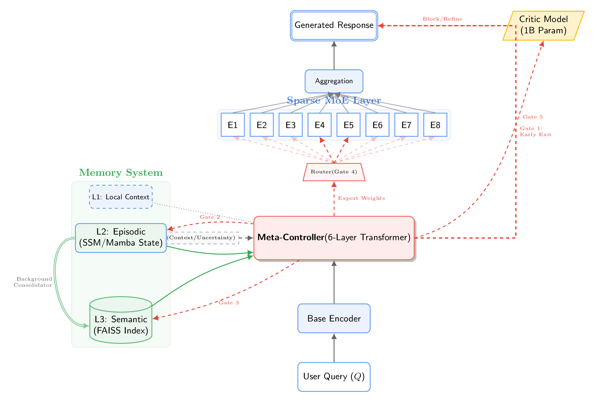

# HMST: Hierarchical Memory-State Transformer

A novel LLM architecture exploring hallucination mitigation and long-context memory through hierarchical memory systems and integrated self-verification.

**Status**: Research prototype with complete architecture implementation but no trained models.

## Architecture



**Components**:
- **Three-tier memory**: Attention (8K) → Episodic SSM → Semantic FAISS
- **Meta-controller**: RL-trainable routing with 5 decision gates
- **MoE base model**: ~12B total, ~2B active parameters (8 experts, top-2)
- **Critic model**: Integrated hallucination detection

**Design Goals** (unvalidated): Reduced hallucinations via verification • Extended context via hierarchical memory • Efficiency via sparse experts • Lower latency via early-exit

---

## Quick Start

```bash
# Install
pip install -r requirements.txt && pip install -e .

# Run tests
python -m pytest tests/ -v

# Demo (untrained model, shows architecture only)
python demo.py

# Start training (Stage 1)
python train.py --stage 1 \
    --hf-dataset roneneldan/TinyStories \
    --hf-val-split validation \
    --streaming \
    --steps-per-epoch 1000
```

---

## Training Pipeline

HMST uses a **3-stage training pipeline**. Each stage builds on the previous:

```
┌─────────────────────────────────────────────────────────────────┐
│  Stage 1: Base MoE Pre-training (REQUIRED)                     │
│  ├─ Trains: Transformer backbone + 8 MoE experts               │
│  ├─ Duration: Days-weeks                                        │
│  └─ Output: Functional LLM ready for text generation            │
└─────────────────────────────────────────────────────────────────┘
                            ↓
┌─────────────────────────────────────────────────────────────────┐
│  Stage 2: Memory Fine-tuning (OPTIONAL)                        │
│  ├─ Trains: Episodic + Semantic memory systems                 │
│  ├─ Duration: Days                                              │
│  └─ Output: Extended context beyond 8K tokens                   │
└─────────────────────────────────────────────────────────────────┘
                            ↓
┌─────────────────────────────────────────────────────────────────┐
│  Stage 3: RL Training (OPTIONAL)                               │
│  ├─ Trains: Meta-controller routing policy                     │
│  ├─ Duration: Hours-days                                        │
│  └─ Output: Adaptive compute & improved efficiency             │
└─────────────────────────────────────────────────────────────────┘
```

**What you need**:
- Basic LLM: Stage 1 only
- + Long context: Stage 1 + 2
- + Adaptive routing: Stage 1 + 3
- Full HMST: All 3 stages

---

## Stage 1: Base MoE Pre-training (REQUIRED)

**What it trains**: Foundation transformer model with Mixture-of-Experts
- Standard next-token prediction
- 8 experts with top-2 routing
- Load balancing loss
- No memory systems (added in Stage 2)
- No meta-controller (added in Stage 3)

### Basic Training

```bash
# Streaming HuggingFace dataset (recommended - no storage needed)
python train.py --stage 1 \
    --hf-dataset roneneldan/TinyStories \
    --hf-val-split validation \
    --streaming \
    --steps-per-epoch 1000 \
    --epochs 10 \
    --model-size tiny

# Local text file (auto-split validation)
python train.py --stage 1 \
    data/train.txt \
    --val-split 0.1 \
    --epochs 20 \
    --model-size tiny

# Production: Pre-split validation for reproducibility
python train.py --stage 1 \
    data/train.txt \
    --val-file data/val.txt \
    --output-dir checkpoints/stage1 \
    --model-size small
```

### Data Sources

**Option 1: HuggingFace Streaming (Easiest)**
```bash
# No download needed - stream directly
python train.py --stage 1 \
    --hf-dataset HuggingFaceFW/fineweb-edu \
    --hf-config sample-10BT \
    --streaming \
    --steps-per-epoch 1000 \
    --mixed-precision

# Use only 10% of dataset
python train.py --stage 1 \
    --hf-dataset wikitext \
    --hf-config wikitext-2-raw-v1 \
    --hf-train-split "train[:10%]" \
    --hf-val-split validation

# Popular datasets:
#   roneneldan/TinyStories      - Small stories (testing)
#   wikitext                     - Wikipedia text
#   openwebtext                  - Web corpus
#   HuggingFaceFW/fineweb-edu   - High-quality web text (10BT subset)
```

**Option 2: Pre-tokenized Local Data (Fastest)**
```bash
# Step 1: Pre-tokenize once (5-10x faster for multiple runs)
python scripts/preprocess_data.py \
    --input data/train.txt \
    --output data/tokenized/train

# Step 2: Split data
python scripts/split_dataset.py  # Creates train_split/ and val/

# Step 3: Train
python train.py --stage 1 \
    data/tokenized/train_split \
    --pretokenized \
    --val-file data/tokenized/val \
    --model-size small
```

**Option 3: Raw Text Files (Simplest)**
```bash
# Single file with auto-split validation
python train.py --stage 1 data/train.txt --val-split 0.1

# Separate train/val files (recommended for production)
python train.py --stage 1 data/train.txt --val-file data/val.txt
```

### Model Sizes

| Size | Parameters | Use Case | VRAM (FP16) |
|------|-----------|----------|-------------|
| `micro` | ~10M | Ultra-fast testing | <2GB |
| `tiny` | ~100M | Development/debugging | ~4GB |
| `small` | ~1B | Experimentation | ~8GB |
| `base` | ~12B | Production | ~32GB |

```bash
# Specify size with --model-size
python train.py --stage 1 data/train.txt --model-size small --val-split 0.1
```

### Multi-GPU Training

```bash
# Auto-detect all GPUs
python train.py --stage 1 data/train.txt --mixed-precision --val-split 0.1

# Use specific GPUs only
python train.py --stage 1 data/train.txt --gpu-ids 0 2 --val-split 0.1

# Mixed VRAM (e.g., 12GB + 6GB GPUs)
python train.py --stage 1 data/train.txt \
    --batch-size 2 \
    --gradient-accumulation-steps 4 \
    --mixed-precision \
    --val-split 0.1
# Effective batch: 2 × 4 × num_gpus = 8 per GPU

# DeepSpeed ZeRO-3 (for very large models or mixed VRAM)
python train.py --stage 1 data/train.txt \
    --deepspeed \
    --cpu-offload \
    --model-size small \
    --batch-size 1 \
    --gradient-accumulation-steps 4 \
    --val-split 0.1
```

### Memory Optimization

```bash
# Basic: Mixed precision (2x memory savings)
python train.py --stage 1 data/train.txt --mixed-precision --val-split 0.1

# Advanced: Gradient checkpointing (40% memory, 30% slower)
python train.py --stage 1 data/train.txt \
    --mixed-precision \
    --gradient-checkpointing \
    --val-split 0.1

# Maximum: 8-bit optimizer (50% optimizer memory)
python train.py --stage 1 data/train.txt \
    --mixed-precision \
    --gradient-checkpointing \
    --use-8bit-optimizer \
    --batch-size 1 \
    --gradient-accumulation-steps 16 \
    --val-split 0.1

# Extreme: Small model on 12GB GPU
python train.py --stage 1 data/train.txt \
    --model-size small \
    --mixed-precision \
    --gradient-checkpointing \
    --use-8bit-optimizer \
    --batch-size 1 \
    --gradient-accumulation-steps 16 \
    --val-split 0.1
```

### Resume Training

```bash
# Resume from checkpoint (continues from saved state)
python train.py --stage 1 data/train.txt \
    --resume checkpoints/stage1/best_model.pt \
    --tokenizer-path checkpoints/stage1/tokenizer \
    --val-split 0.1

# Continue for more epochs (e.g., 20 → 50 total epochs)
python train.py --stage 1 data/train.txt \
    --resume checkpoints/stage1/final_model.pt \
    --tokenizer-path checkpoints/stage1/tokenizer \
    --epochs 50 \
    --val-split 0.1
```

**Note**: `--tokenizer-path` is required when resuming. Restores model weights, optimizer state, scheduler, and training progress.

### Expected Results (Stage 1)

After successful training on FineWeb-edu (small model, 4 epochs):
- **Validation PPL**: 20-50 (good), <20 (excellent)
- **Output quality**: Coherent text generation
- **Ready for**: Inference or Stage 2/3 training

**Outputs**:
- `checkpoints/stage1/best_model.pt` - Best validation checkpoint
- `checkpoints/stage1/final_model.pt` - Final epoch checkpoint
- `checkpoints/stage1/tokenizer/` - Trained tokenizer (reuse for later stages)
- `checkpoints/stage1/epoch_N.pt` - Periodic checkpoints

### Full Example: Production Training

```bash
# High-quality training run with all optimizations
python train.py --stage 1 \
    --hf-dataset HuggingFaceFW/fineweb-edu \
    --hf-config sample-10BT \
    --streaming \
    --steps-per-epoch 1000 \
    --model-size small \
    --output-dir checkpoints/stage1_production \
    --epochs 10 \
    --batch-size 8 \
    --gradient-accumulation-steps 64 \
    --learning-rate 3e-4 \
    --warmup-steps 100 \
    --mixed-precision \
    --gradient-checkpointing \
    --use-8bit-optimizer \
    --eval-every 500 \
    --patience 5 \
    --save-every 1

# Duration: ~Days-weeks depending on hardware
# Output: checkpoints/stage1_production/best_model.pt
```

---

## Stage 2: Memory Fine-tuning (OPTIONAL)

**What it trains**: Hierarchical memory systems for extended context
- Episodic memory (SSM-based, 8K recent context)
- Semantic memory (FAISS vector DB, 1M+ long-term entries)
- Memory consolidation (episodic → semantic transfer)

**When to use**: If you need context beyond the 8K attention window

**Status**: ✅ **IMPLEMENTED**

### Usage

```bash
# Fine-tune memory on top of Stage 1 model
python train.py --stage 2 \
    --resume checkpoints/stage1/best_model.pt \
    --tokenizer-path checkpoints/stage1/tokenizer \
    --epochs 5 \
    --output-dir checkpoints/stage2

# With custom dataset (recommended for production)
python train.py --stage 2 \
    --resume checkpoints/stage1/best_model.pt \
    --tokenizer-path checkpoints/stage1/tokenizer \
    --hf-dataset QuALITY \
    --epochs 5 \
    --steps-per-epoch 500
```

**Note**: Uses demo dataset by default. For production, provide long-context datasets (QuALITY, NarrativeQA, etc.).

---

## Stage 3: RL Training (OPTIONAL)

**What it trains**: Meta-controller routing policy via reinforcement learning
- 5 decision gates:
  - Early exit (skip processing for simple queries)
  - Episodic memory access
  - Semantic memory retrieval
  - Expert selection (MoE routing)
  - Verification trigger (critic model)
- PPO (Proximal Policy Optimization)
- Multi-objective reward: accuracy - 0.3×latency - 0.2×compute + 0.5×calibration

**When to use**: After Stage 1 (or Stage 2) to optimize dynamic routing and efficiency

**Status**: ✅ **IMPLEMENTED**

### Usage

```bash
# Optimize meta-controller on top of Stage 1 model
python train.py --stage 3 \
    --resume checkpoints/stage1/best_model.pt \
    --tokenizer-path checkpoints/stage1/tokenizer \
    --rl-episodes 50000 \
    --rl-batch-size 256 \
    --output-dir checkpoints/stage3

# After Stage 2 (with memory systems)
python train.py --stage 3 \
    --resume checkpoints/stage2/memory_system_final.pt \
    --tokenizer-path checkpoints/stage1/tokenizer \
    --rl-episodes 100000 \
    --output-dir checkpoints/stage3_full
```

**Note**: Uses demo dataset by default (10 Q&A pairs). For production, provide large Q&A datasets (1000+ examples).

**Expected Results**:
- Improved efficiency via adaptive routing
- Better accuracy/latency trade-offs
- Dynamic compute allocation based on query complexity

---

## Inference

After Stage 1 training completes, use the model for text generation:

```bash
# Interactive mode
python inference.py checkpoints/stage1/best_model.pt

# Single prompt
python inference.py checkpoints/stage1/best_model.pt \
    --prompt "Once upon a time"

# Greedy decoding (deterministic, temperature=0)
python inference.py checkpoints/stage1/best_model.pt \
    --prompt "The capital of France is" \
    --temperature 0

# Creative generation (higher temperature)
python inference.py checkpoints/stage1/best_model.pt \
    --prompt "Write a story about robots:" \
    --temperature 1.2 \
    --max-length 200

# Batch generation from file
python inference.py checkpoints/stage1/best_model.pt \
    --input prompts.txt \
    --output results.txt

# Quantized inference (2-4x faster)
python inference.py checkpoints/stage1/best_model.pt \
    --prompt "Hello world" \
    --quantize int8
```

**RTX 3060 Known Issue**: If you encounter `CUBLAS_STATUS_NOT_INITIALIZED` errors:
```bash
export CUBLAS_WORKSPACE_CONFIG=:0:0
export TORCH_BLAS_PREFER_CUBLASLT=0
python inference.py checkpoints/stage1/best_model.pt --prompt "Hello"
```

---

## Common Training Options

### Key Flags

| Flag | Description | Example |
|------|-------------|---------|
| `--stage` | Training stage (1, 2, or 3) | `--stage 1` |
| `--model-size` | Model size (micro/tiny/small/base) | `--model-size small` |
| `--hf-dataset` | HuggingFace dataset name | `--hf-dataset wikitext` |
| `--streaming` | Stream without download | `--streaming` |
| `--val-split` | Auto-split validation (%) | `--val-split 0.1` |
| `--val-file` | Separate validation file | `--val-file data/val.txt` |
| `--resume` | Resume from checkpoint | `--resume ckpt/best_model.pt` |
| `--tokenizer-path` | Reuse existing tokenizer | `--tokenizer-path ckpt/tokenizer` |
| `--mixed-precision` | Use FP16 (2x memory save) | `--mixed-precision` |
| `--gradient-checkpointing` | Trade compute for memory | `--gradient-checkpointing` |
| `--use-8bit-optimizer` | 8-bit AdamW (50% optimizer memory) | `--use-8bit-optimizer` |
| `--deepspeed` | Enable DeepSpeed ZeRO-3 | `--deepspeed` |
| `--gpu-ids` | Select specific GPUs | `--gpu-ids 0 2` |

Full list: `python train.py --help`

### Validation Options

```bash
# Auto-split (convenient, reshuffles each run)
--val-split 0.1

# Pre-split file (reproducible, production)
--val-file data/val.txt

# HuggingFace dataset split
--hf-val-split validation

# Cannot combine --val-split with --val-file
```

### Tokenizer Management

```bash
# First run: Creates tokenizer
python train.py --stage 1 data/train.txt --val-split 0.1
# → Saves to checkpoints/train/tokenizer

# Later runs: Reuse for consistency
python train.py --stage 1 data/new.txt \
    --tokenizer-path checkpoints/train/tokenizer \
    --val-split 0.1

# Required when resuming
python train.py --stage 1 data/train.txt \
    --resume checkpoints/train/best_model.pt \
    --tokenizer-path checkpoints/train/tokenizer \
    --val-split 0.1
```

---

## Troubleshooting

### Out of Memory (OOM)

```bash
# Try in this order:
1. Add --mixed-precision
2. Add --gradient-checkpointing
3. Reduce --batch-size (e.g., to 2 or 1)
4. Add --gradient-accumulation-steps 8 (or higher)
5. Add --use-8bit-optimizer
6. Add --deepspeed --cpu-offload (multi-GPU only)
7. Use smaller --model-size

# Example: Fit small model on 12GB GPU
python train.py --stage 1 data/train.txt \
    --model-size small \
    --batch-size 1 \
    --gradient-accumulation-steps 16 \
    --mixed-precision \
    --gradient-checkpointing \
    --use-8bit-optimizer \
    --val-split 0.1
```

### Slow Training

```bash
# Pre-tokenize data (5-10x faster)
python scripts/preprocess_data.py --input data/train.txt --output data/tok
python train.py --stage 1 data/tok --pretokenized --val-split 0.1

# Use streaming HF datasets (no disk I/O)
python train.py --stage 1 --hf-dataset wikitext --streaming

# Enable mixed precision (2x faster)
python train.py --stage 1 data/train.txt --mixed-precision --val-split 0.1

# Use multiple GPUs
python train.py --stage 1 data/train.txt --val-split 0.1  # Auto-detects
```

### Resume Errors

```bash
# Must specify tokenizer path
python train.py --stage 1 data/train.txt \
    --resume checkpoints/best_model.pt \
    --tokenizer-path checkpoints/tokenizer  # ← Required!
    --val-split 0.1

# Use same data source as original run
# If original used --hf-dataset, use --hf-dataset
# If original used local file, use local file
```

### Mixed VRAM GPUs

```bash
# Use gradient accumulation to balance load
python train.py --stage 1 data/train.txt \
    --batch-size 2 \
    --gradient-accumulation-steps 4 \
    --mixed-precision \
    --val-split 0.1

# Or use DeepSpeed ZeRO-3 (handles automatically)
python train.py --stage 1 data/train.txt \
    --deepspeed \
    --batch-size 2 \
    --val-split 0.1
```

---

## Testing

```bash
# All tests
python -m pytest tests/ -v

# Specific test suite
python -m pytest tests/test_models.py -v

# With coverage
python -m pytest tests/ --cov=hmst --cov-report=html
```

---

## Project Structure

```
hmst/
├── models/           # base_moe, meta_controller, critic, ssm
├── memory/           # episodic, semantic, consolidation
├── training/         # pretrain, memory_train, rl_train
├── inference/        # engine
├── configs/          # model_config (presets: micro/tiny/small/base)
├── tokenizer.py      # HMSTTokenizer (GPT-2 BPE wrapper)
evaluation/           # benchmarks, metrics, evaluation harness
├── benchmarks.py     # MMLU, TruthfulQA, HumanEval, GSM8K
├── metrics.py        # Accuracy, F1, hallucination rate, calibration
train.py              # Main training script (--stage 1/2/3)
inference.py          # Text generation script
demo.py               # Architecture demo (untrained)
tests/                # Unit tests
scripts/              # preprocess_data.py, split_dataset.py, run_eval.py
```

---

## Requirements & Validation

**Current Status**: Research prototype with complete architecture but **no trained weights**.

**Training Requirements** (for production results):
- Compute: 2-5T tokens • 500K-1M A100 GPU-hours • ~$750K-$1.5M budget
- Data: High-quality corpus (FineWeb-edu, C4, etc.)
- Time: Weeks-months for full training

**Evaluation Requirements** (to validate design claims):
- Benchmarks: MMLU, TruthfulQA, HumanEval, GSM8K ✅ **Implemented**
- Hallucination metrics ✅ **Implemented**
- Baseline comparisons: Use `scripts/run_eval.py`

**Current Limitations**:
- No trained weights (architecture only)
- Evaluation uses demo datasets (download real benchmarks for production)
- True attention limited to 8K (not 1M)

---

## Component Details

### BaseMoEModel
- 8 experts with top-2 routing
- Load balancing loss
- Scales from 100M to 12B parameters
- Standard transformer backbone

### MetaController
- 6-layer lightweight transformer
- 5 routing gates: early-exit, episodic/semantic memory, expert selection, verification
- RL-trainable via PPO (Stage 3)

### Memory Systems
- **Episodic**: SSM-based (Mamba-style), 8K token window, L2 cache
- **Semantic**: FAISS vector DB, 1M+ entries, L3 cache
- **Consolidation**: Background transfer episodic → semantic

### Critic Model
- 1-2B parameter verification model
- Hallucination detection via consistency checking

---

## Known Issues & Warnings

### SSM Performance
⚠️ Episodic memory uses unoptimized Python loop (100-1000x slower than CUDA).
- **Solution**: Use short sequences (<1024) or wait for optimization
- **Alternative**: Use mamba-ssm package when implemented

### Semantic Memory Scaling
⚠️ Stores embeddings in RAM (12GB+ for 1M entries).
- **Limit**: ~100K entries on 16GB RAM systems
- **Solution**: Disk-backed storage planned for production

### TextDataset Memory
⚠️ Loads all tokens into RAM (not true streaming).
- **Limit**: ~10GB text files on 32GB RAM systems
- **Solution**: Use `--pretokenized` or `--hf-dataset --streaming`

---

## Evaluation

Run benchmarks on trained models:

```bash
# Test with demo dataset
python scripts/run_eval.py checkpoints/stage1/best_model.pt \
    --tokenizer checkpoints/stage1/tokenizer \
    --all --demo

# Run specific benchmarks
python scripts/run_eval.py checkpoints/stage1/best_model.pt \
    --tokenizer checkpoints/stage1/tokenizer \
    --benchmarks mmlu truthfulqa \
    --output results.json

# After downloading real datasets
python scripts/run_eval.py checkpoints/stage1/best_model.pt \
    --tokenizer checkpoints/stage1/tokenizer \
    --all \
    --output full_results.json
```

**Available Benchmarks**:
- MMLU (knowledge across 57 subjects)
- TruthfulQA (hallucination detection)
- HumanEval (code generation)
- GSM8K (math reasoning)

**Metrics**: Accuracy, F1, hallucination rate, calibration error, pass rate

---

## Contributing & Roadmap

**Contributions Welcome**:
- Training runs and benchmark results
- Real dataset integration
- Optimizations (SSM parallelization, memory scaling)
- Bug fixes and documentation

**Roadmap**:
1. ~~Complete Stage 2 and Stage 3 integration~~ ✅ Done
2. ~~Implement evaluation framework~~ ✅ Done
3. SSM optimization (parallel scan or CUDA kernel)
4. Memory system scaling (disk-backed storage)
5. Full-scale training runs
6. Benchmark validation with real data

---

## License & Acknowledgments

MIT License

Developed with assistance from Claude (Anthropic) and Gemini (Google DeepMind).

---

**Disclaimer**: Research prototype. Performance claims are unvalidated architectural design goals requiring large-scale training and evaluation for proper assessment. No trained models or benchmark results are currently available.
