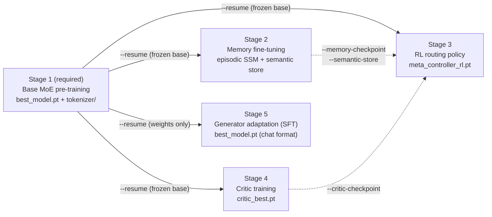

# MANTIS: Metacognitive Adaptive Network with Tiered Inference Strategies

A novel LLM architecture exploring hallucination mitigation and long-context memory through metacognitive routing, hierarchical memory systems, and integrated self-verification.

**Status**: Research prototype with complete architecture implementation but no trained models.

## Architecture


**Components**:
- **Three-tier memory**: Attention (8K window in the `base` preset) → Episodic SSM retrieval keys → Semantic FAISS store with namespaces and trust levels
- **Meta-controller**: RL-trainable routing with 5 decision gates (bypass, episodic, semantic, expert bias, verification)
- **MoE base model**: ~6.7B total, ~1.9B active parameters (8 experts, top-2, grouped-query attention)
- **Critic model**: verification head over the frozen base model's hidden states, with one bounded evidence-recovery round before abstaining

**Design Goals** (unvalidated): Reduced hallucinations via evidence-grounded verification • Extended context via hierarchical memory • Efficiency via sparse experts • Lower cost via bypassing retrieval and verification on predictable queries

---

## Quick Start

The project is managed with [uv](https://docs.astral.sh/uv/): `uv run <script>` creates `.venv` from `uv.lock` on first use and keeps it in sync, so no manual environment setup is needed. Activate `.venv` instead if you prefer plain `python`.

```bash
# Core: Stage 1, the tokenizer and basic inference (CUDA torch on Linux)
uv sync

# Extras: memory (mamba-ssm + faiss, needs CUDA and nvcc), distributed (deepspeed),
# bnb (8-bit optimizer), wandb, web (playground server). mamba-ssm compiles from
# source when no prebuilt wheel matches; TORCH_CUDA_ARCH_LIST limits it to your GPUs.
TORCH_CUDA_ARCH_LIST="8.6" MAX_JOBS=4 uv sync --extra memory --extra distributed

# Start training (Stage 1)
uv run train.py --stage 1 \
    --hf-dataset roneneldan/TinyStories \
    --hf-val-split validation \
    --streaming \
    --steps-per-epoch 1000
```

---

## Training Pipeline

MANTIS trains in five stages, but they do not form a chain. Only Stages 1 and 5 train the base model. Stages 2–4 each train a separate component and leave the base model unchanged, which is why all of them pass the Stage 1 checkpoint to `--resume`. Stage 3 then picks up the Stage 2 and Stage 4 outputs through their own flags:


```mermaid
flowchart LR
    S1["Stage 1 (required)<br/>Base MoE pre-training<br/>best_model.pt + tokenizer/"]
    S2["Stage 2<br/>Memory fine-tuning<br/>episodic SSM + semantic store"]
    S4["Stage 4<br/>Critic training<br/>critic_best.pt"]
    S3["Stage 3<br/>RL routing policy<br/>meta_controller_rl.pt"]
    S5["Stage 5<br/>Generator adaptation (SFT)<br/>best_model.pt (chat format)"]
    S1 -- "--resume (frozen base)" --> S2
    S1 -- "--resume (frozen base)" --> S4
    S1 -- "--resume (frozen base)" --> S3
    S1 -- "--resume (weights only)" --> S5
    S2 -. "--memory-checkpoint<br/>--semantic-store" .-> S3
    S4 -. "--critic-checkpoint" .-> S3
```

The dotted inputs are optional. Without them, Stage 3 keeps the matching gates closed. Run Stages 2, 4 and 5 in any order, then Stage 3. A Stage 5 checkpoint can replace the Stage 1 checkpoint as the base for Stages 2–4, so the memory, critic and policy are trained against the generator that will answer.

**What you need**:
- Basic LLM: Stage 1 only
- + Long context: Stage 1 + 2
- + Adaptive routing: Stage 1 + 3
- + A generator that follows instructions and cites evidence: Stage 1 + 5
- Full MANTIS: all 5 stages

---

## Stage 1: Base MoE Pre-training (REQUIRED)

**What it trains**: Foundation transformer model with Mixture-of-Experts
- Standard next-token prediction
- Top-2 routing over 4 experts (`tiny`, `small`) or 8 (`medium`, `base`); `micro` is dense
- Load balancing loss (top-1 based); `expert_load` in the model output reports the top-2 dispatch per layer
- Grouped-query attention (`n_kv_heads` per preset)
- No memory systems (added in Stage 2)
- No meta-controller (added in Stage 3)

### Basic Training

```bash
# Streaming HuggingFace dataset (recommended - no storage needed)
uv run train.py --stage 1 \
    --hf-dataset roneneldan/TinyStories \
    --hf-val-split validation \
    --streaming \
    --steps-per-epoch 1000 \
    --epochs 10 \
    --model-size tiny

# Local text file (auto-split validation)
uv run train.py --stage 1 \
    data/train.txt \
    --val-split 0.1 \
    --epochs 20 \
    --model-size tiny

# Production: Pre-split validation for reproducibility
uv run train.py --stage 1 \
    data/train.txt \
    --val-file data/val.txt \
    --output-dir checkpoints/stage1 \
    --model-size small
```

### Data Sources

**Option 1: HuggingFace Streaming (Easiest)**
```bash
# No download needed - stream directly
uv run train.py --stage 1 \
    --hf-dataset HuggingFaceFW/fineweb-edu \
    --hf-config sample-10BT \
    --streaming \
    --steps-per-epoch 1000 \
    --mixed-precision

# Use only 10% of dataset
uv run train.py --stage 1 \
    --hf-dataset wikitext \
    --hf-config wikitext-2-raw-v1 \
    --hf-train-split "train[:10%]" \
    --hf-val-split validation

# Popular datasets:
#   roneneldan/TinyStories      - Small stories (testing)
#   wikitext                     - Wikipedia text
#   openwebtext                  - Web corpus
#   HuggingFaceFW/fineweb-edu   - High-quality web text (10BT subset)
```

**Option 2: Pre-tokenized Local Data (Fastest)**
```bash
# Step 1: Pre-tokenize once (5-10x faster for multiple runs)
uv run scripts/preprocess_data.py \
    --input data/train.txt \
    --output data/tokenized/train

# Step 2: Split data
uv run scripts/split_dataset.py  # Creates train_split/ and val/

# Step 3: Train
uv run train.py --stage 1 \
    data/tokenized/train_split \
    --pretokenized \
    --val-file data/tokenized/val \
    --model-size small
```

**Option 3: Raw Text Files (Simplest)**
```bash
# Single file with auto-split validation
uv run train.py --stage 1 data/train.txt --val-split 0.1

# Separate train/val files (recommended for production)
uv run train.py --stage 1 data/train.txt --val-file data/val.txt
```

### Model Sizes

| Size | Parameters (active) | Query/KV heads | Controller | Critic | Use Case | Training VRAM |
|------|-----------|------|------|------|----------|-------------|
| `micro` | ~3M (dense) | 4/4 | 0.6M | 2.2M | Ultra-fast testing | ~0.7GB |
| `tiny` | ~55M (~30M) | 8/4 | 2.4M | 14M | Development/debugging | ~1.9GB |
| `small` | ~435M (~234M) | 32/8 | 18M | 45M | Experimentation | ~10GB (~7GB with `--gradient-checkpointing --use-8bit-optimizer`) |
| `medium` | ~2.2B (~0.7B) | 24/8 | 41M | 80M | One 48 GB GPU | ~42GB (~29GB with `--gradient-checkpointing --use-8bit-optimizer`) |
| `base` | ~6.7B (~1.9B) | 32/8 | 106M | 80M | Production | ~128GB (~89GB with `--gradient-checkpointing --use-8bit-optimizer`) |

Parameter counts are for the 512-token evolution tokenizer; the default 32K BPE vocabulary adds `32768 × d_model` tied embedding parameters (8M for `micro`, 134M for `base`). The controller and critic scale with the preset, so a `micro` full-system run is a micro-size system. VRAM comes from `mantis/training/vram_estimator.py` for FP16 mixed precision, batch size 1, `--seq-len 512` and the 32K vocabulary.

```bash
# Specify size with --model-size
uv run train.py --stage 1 data/train.txt --model-size small --val-split 0.1
```

### Multi-GPU Training

```bash
# One process per GPU (a plain `uv run train.py` uses a single GPU)
uv run torchrun --nproc_per_node=2 train.py --stage 1 data/train.txt --mixed-precision --val-split 0.1

# Use specific GPUs only
uv run torchrun --nproc_per_node=2 train.py --stage 1 data/train.txt --gpu-ids 0 2 --val-split 0.1

# Mixed VRAM (e.g., 12GB + 6GB GPUs)
uv run train.py --stage 1 data/train.txt \
    --batch-size 2 \
    --gradient-accumulation-steps 4 \
    --mixed-precision \
    --val-split 0.1
# Effective batch: 2 × 4 = 8 per GPU, times the number of GPUs

# DeepSpeed ZeRO-2 with optimizer offload (for very large models or mixed VRAM; needs `--extra distributed`)
uv run torchrun --nproc_per_node=2 train.py --stage 1 data/train.txt \
    --deepspeed \
    --cpu-offload \
    --model-size small \
    --batch-size 1 \
    --gradient-accumulation-steps 4 \
    --val-split 0.1

# Model too large for one GPU: split its layers over all visible GPUs by free VRAM.
# Single process (no torchrun); the GPUs run one after another, so this adds capacity, not speed.
uv run train.py --stage 1 data/train.txt --pipeline --model-size small \
    --mixed-precision --gradient-checkpointing --batch-size 32 --val-split 0.1
```

Under torchrun every rank gets the same batch size: the largest that fits the free VRAM of the smallest GPU, capped by `--batch-size`. `--pipeline` and `--auto-batch` size the batch the same way from the free VRAM the run actually gets.

### Memory Optimization

```bash
# Basic: Mixed precision (2x memory savings); `--mixed-precision bf16` on Ampere or newer
uv run train.py --stage 1 data/train.txt --mixed-precision --val-split 0.1

# Advanced: Gradient checkpointing (40% memory, 30% slower)
uv run train.py --stage 1 data/train.txt \
    --mixed-precision \
    --gradient-checkpointing \
    --val-split 0.1

# Maximum: 8-bit optimizer (50% optimizer memory)
uv run train.py --stage 1 data/train.txt \
    --mixed-precision \
    --gradient-checkpointing \
    --use-8bit-optimizer \
    --batch-size 1 \
    --gradient-accumulation-steps 16 \
    --val-split 0.1

# Extreme: Small model on 12GB GPU
uv run train.py --stage 1 data/train.txt \
    --model-size small \
    --mixed-precision \
    --gradient-checkpointing \
    --use-8bit-optimizer \
    --batch-size 1 \
    --gradient-accumulation-steps 16 \
    --val-split 0.1
```

### Resume Training

```bash
# Resume from checkpoint (continues from saved state)
uv run train.py --stage 1 data/train.txt \
    --resume checkpoints/stage1/best_model.pt \
    --tokenizer-path checkpoints/stage1/tokenizer \
    --val-split 0.1

# Continue for more epochs (e.g., 20 → 50 total epochs)
uv run train.py --stage 1 data/train.txt \
    --resume checkpoints/stage1/final_model.pt \
    --tokenizer-path checkpoints/stage1/tokenizer \
    --epochs 50 \
    --val-split 0.1
```

**Note**: `--tokenizer-path` is required when resuming. Resuming restores model weights, optimizer state, scheduler, and training progress. Use the same data source as the original run: a local file if it trained on one, `--hf-dataset` if it streamed.

### Outputs (Stage 1)

- `checkpoints/stage1/best_model.pt` - Best validation checkpoint
- `checkpoints/stage1/final_model.pt` - Final epoch checkpoint
- `checkpoints/stage1/tokenizer/` - Tokenizer files (reuse for later stages)
- `checkpoints/stage1/epoch_N.pt` - Periodic checkpoints (`--save-every`)

### Full Example: Production Training

```bash
# High-quality training run with all optimizations
uv run train.py --stage 1 \
    --hf-dataset HuggingFaceFW/fineweb-edu \
    --hf-config sample-10BT \
    --streaming \
    --steps-per-epoch 1000 \
    --model-size small \
    --output-dir checkpoints/stage1_production \
    --epochs 10 \
    --batch-size 8 \
    --gradient-accumulation-steps 64 \
    --learning-rate 3e-4 \
    --warmup-steps 100 \
    --mixed-precision \
    --gradient-checkpointing \
    --use-8bit-optimizer \
    --eval-every 500 \
    --patience 5 \
    --save-every 1

# Duration: ~Days-weeks depending on hardware
# Output: checkpoints/stage1_production/best_model.pt
```

---

## Stage 2: Memory Fine-tuning (OPTIONAL)

**What it trains**: Hierarchical memory systems for extended context, with the Stage 1 model frozen
- Episodic memory SSM: a query's state learns to match its context's state (contrastive)
- Semantic projection: projected query embeddings learn to retrieve their context (contrastive)
- Afterwards every context goes into a semantic memory store (`semantic_memory.index/.meta`)

**When to use**: If you need context beyond the 8K attention window

**Status**: IMPLEMENTED

### Usage

```bash
# Fine-tune memory on top of Stage 1 model
uv run train.py --stage 2 \
    --resume checkpoints/stage1/best_model.pt \
    --tokenizer-path checkpoints/stage1/tokenizer \
    --epochs 5 \
    --output-dir checkpoints/stage2

# With your own data (recommended): JSONL lines of {"query": ..., "context": ...}
uv run train.py --stage 2 data/memory.jsonl \
    --resume checkpoints/stage1/best_model.pt \
    --tokenizer-path checkpoints/stage1/tokenizer \
    --epochs 5 \
    --steps-per-epoch 500 \
    --output-dir checkpoints/stage2
```

**Note**: Without a data file, Stage 2 uses an 8-pair demo set. Build real pairs from long-context datasets (QuALITY, NarrativeQA, etc.). Stage 1-only flags such as `--hf-dataset` or `--mixed-precision` are rejected. The store records a fingerprint of the base model's tokenizer and full backbone weights; the engine refuses a store built by a different model. Stage 2 contexts land in the shared `global` namespace with full trust.

---

## Stage 4: Critic Training (OPTIONAL)

**What it trains**: The critic that scores whether a response is correct given the evidence. It is a small encoder over the frozen Stage 1 model's hidden states of `[evidence; query; response]`, so it starts from the backbone's language knowledge. Data is split into train, calibration and validation parts; a temperature fitted on the calibration part makes the score a calibrated probability, and the run reports validation accuracy, Brier score and ECE. A trained critic enables the verification gate in Stage 3 and in the full engine.

```bash
# JSONL lines of {"query": ..., "response": ..., "evidence": "..." or [...] (optional), "label": 0 or 1}
uv run train.py --stage 4 data/critic.jsonl \
    --resume checkpoints/stage1/best_model.pt \
    --tokenizer-path checkpoints/stage1/tokenizer \
    --epochs 3 \
    --output-dir checkpoints/critic
```

**Note**: Without a data file, Stage 4 uses a demo set whose negatives include mismatched, negated and altered answers. Real training needs near-miss negatives and outputs from the actual generator.

---

## Stage 3: RL Training (OPTIONAL)

**What it trains**: Meta-controller routing policy via reinforcement learning
- 5 decision gates:
  - Bypass (skip memory reads, expert bias and verification; the backbone still runs at full depth)
  - Episodic memory access
  - Semantic memory retrieval
  - Expert bias (bounded, per layer, off by default until `InferenceConfig.expert_bias` is set)
  - Verification trigger (critic model)
- PPO (Proximal Policy Optimization); only the actions that affected the outcome enter the log-probability
- Reward: accuracy − 0.3×latency − 0.2×compute + 0.5×calibration, where accuracy is a lexical match that rejects negated answers and scores abstentions separately, latency is measured against a declared 2 s budget, compute is the measured token-parameter work beyond a query-only answer, and calibration uses the final reported confidence
- Optional supervised warm start (`--rl-supervised-episodes`): evaluates every gate combination per query on frozen memory and trains toward the best one
- Validation runs on frozen memory and reports accuracy, coverage, error rate among answered questions, p95 latency and mean compute

**When to use**: After Stage 1 to optimize dynamic routing and efficiency. Each optional component (Stage 2 memory, Stage 2 semantic store, Stage 4 critic) enables its gate; without it the gate stays closed. Training episodes write to memory, so training is a sequential stateful process.

**Status**: IMPLEMENTED

### Usage

```bash
# Optimize meta-controller on top of Stage 1 model
uv run train.py --stage 3 \
    --resume checkpoints/stage1/best_model.pt \
    --tokenizer-path checkpoints/stage1/tokenizer \
    --rl-episodes 50000 \
    --rl-batch-size 256 \
    --output-dir checkpoints/stage3

# All gates, with your own JSONL lines of {"query": ..., "answer": ...}
uv run train.py --stage 3 data/qa.jsonl \
    --resume checkpoints/stage1/best_model.pt \
    --tokenizer-path checkpoints/stage1/tokenizer \
    --memory-checkpoint checkpoints/stage2/memory_system_final.pt \
    --semantic-store checkpoints/stage2/semantic_memory \
    --critic-checkpoint checkpoints/critic/critic_best.pt \
    --rl-supervised-episodes 2000 \
    --rl-episodes 100000 \
    --output-dir checkpoints/stage3_full
```

**Note**: Without a data file, Stage 3 uses a 10-pair demo set. For production, provide 1000+ query-answer pairs. The saved `meta_controller_rl.pt` records the component paths, so `MANTISInferenceEngine.from_checkpoints(policy_checkpoint=...)` rebuilds the full engine.

**Hypotheses to test** (no results exist yet): lower measured cost at comparable quality than the same backbone with every gate open, and better quality–cost curves than fixed policies. `scripts/run_eval.py --route-policy` runs those controls.

---

## Stage 5: Generator Adaptation (OPTIONAL)

**What it trains**: The base model itself, on instruction data in the prompt format the engine uses at runtime: `User: ... / Assistant:` roles and an `<evidence>` block whose lines carry source identifiers. Stages 2–4 leave the generator frozen, so without this stage better retrieval need not produce better answers. The loss covers response tokens only. Records may include distractor or contradictory evidence and unanswerable questions whose response is an abstention. The saved checkpoint sets `prompt_format = 'chat'` so the engine builds prompts the way the model was trained.

```bash
# JSONL lines of {"query": ..., "response": ..., "evidence": [...] (optional)}
uv run train.py --stage 5 data/sft.jsonl \
    --resume checkpoints/stage1/best_model.pt \
    --tokenizer-path checkpoints/stage1/tokenizer \
    --val-split 0.1 --epochs 3 --mixed-precision bf16 \
    --output-dir checkpoints/stage5
```

`--resume` supplies the weights only; the optimizer and schedule start fresh. Stage 1 flags (`--mixed-precision`, `--gradient-checkpointing`, ...) apply.

---

## Inference

After Stage 1 training completes, use the model for text generation:

```bash
# Interactive mode
uv run inference.py checkpoints/stage1/best_model.pt

# Single prompt
uv run inference.py checkpoints/stage1/best_model.pt \
    --prompt "Once upon a time"

# Greedy decoding (deterministic, temperature=0)
uv run inference.py checkpoints/stage1/best_model.pt \
    --prompt "The capital of France is" \
    --temperature 0

# Creative generation (higher temperature)
uv run inference.py checkpoints/stage1/best_model.pt \
    --prompt "Write a story about robots:" \
    --temperature 1.2 \
    --max-length 200

# Batch generation from file
uv run inference.py checkpoints/stage1/best_model.pt \
    --input prompts.txt \
    --output results.txt

# INT8 dynamic quantization (always runs on CPU)
uv run inference.py checkpoints/stage1/best_model.pt \
    --prompt "Hello world" \
    --quantize int8
```

The model's context window equals the `--seq-len` it was trained with. Longer generations re-encode the most recent half-window when the cache fills.

The full engine (routing, memory, critic) is a Python API:

```python
from mantis.inference.engine import MANTISInferenceEngine

engine = MANTISInferenceEngine.from_checkpoints(
    policy_checkpoint="checkpoints/stage3/meta_controller_rl.pt",  # records the component paths
    memory_dir="runtime/memory",   # runtime memory state, loaded if present and checkpointed
    dtype="bfloat16",              # serving precision of the backbone
)
engine.ingest(open("notes.txt").read(), namespace="alice", source="user")
result = engine.generate("What did I decide about the venue?", namespace="alice")
print(result["response"], result["confidence"], result["confidence_source"], result["evidence"])
engine.close()  # flushes consolidation and saves memory_dir
```

`generate()` encodes the query once and reuses that prefill for decoding unless evidence is prepended. Input longer than the window is ingested into memory as document chunks. The result reports the path taken, the critic score, whether the engine abstained, the evidence identifiers used, per-component timings, token counts and `compute_units`. `frozen_memory()` disables writes for evaluation.

**GPU quirks** (opt-in, nothing is set automatically): `CUBLAS_STATUS_NOT_INITIALIZED` on some Ampere consumer cards goes away with `CUBLAS_WORKSPACE_CONFIG=:0:0 TORCH_BLAS_PREFER_CUBLASLT=0`; a multi-GPU box whose cards cannot do peer-to-peer transfers needs `NCCL_P2P_DISABLE=1` or NCCL hangs.

---

## Evolution Simulation

`MANTISTokenizer`, a fixed 512-token trie tokenizer (`--tokenizer mantis`), is built for the protocol of `mantis/simulation`, an ecological simulator that writes evolving ecosystems as text. A model trained on these traces continues a world tick by tick. [EVOLUTION_SIM_OVERVIEW.md](EVOLUTION_SIM_OVERVIEW.md) covers the simulator, the protocol and the training settings.

```bash
# 1. Generate three datasets, capped at increasing epochs
uv run scripts/gen_evo_dataset.py --worlds 5000 --max-epoch CAMBRIAN  --output data/evo_bio.txt --compact --workers 8
uv run scripts/gen_evo_dataset.py --worlds 5000 --max-epoch ECOSYSTEM --output data/evo_eco.txt --compact --workers 8 --enable-agents
uv run scripts/gen_evo_dataset.py --worlds 5000                       --output data/evo_intel.txt --compact --workers 8 --enable-agents

# 2. Train with a curriculum that shifts from the bio to the intel data
uv run train_evo.py \
    --bio data/evo_bio.txt --eco data/evo_eco.txt --intel data/evo_intel.txt \
    --model-size tiny --seq-len 2048 --batch-size 8 \
    --steps-per-epoch 1000 --epochs 20 --mixed-precision --val-split 0.1
# Partitions are tokenized once into data/.evo_cache (--cache-dir); --prepare-data-only builds the cache and exits

# 3. Generate a new world
uv run inference_evo.py checkpoints/evo_train/best_model.pt --new-world --seed 42 --max-ticks 100
```

To route **each tick** through episodic and semantic retrieval, the trained
meta-controller, and critic verification, pass a Stage 3 policy trained against
the same evolution backbone. Its checkpoint can carry the Stage 2 memory/store
and Stage 4 critic paths; pass the explicit overrides if those paths moved:

```bash
uv run inference_evo.py checkpoints/evo_train/best_model.pt \
    --new-world --seed 42 --max-ticks 100 \
    --policy-checkpoint checkpoints/evo_policy/meta_controller_rl.pt \
    --memory-checkpoint checkpoints/evo_memory/memory_system_final.pt \
    --semantic-store checkpoints/evo_memory/semantic_memory \
    --critic-checkpoint checkpoints/evo_critic/critic_best.pt \
    --memory-dir runtime/evo --namespace world-42
```

This mode requires all three trained auxiliary artifacts and a raw-format
evolution generator. The policy chooses which gates run per tick; use
`--route-policy always` to exercise every available gate in an ablation.
Retrieved history is prepended as trace text, and generation stops at the
`---` tick delimiter. An answer rejected by the critic ends the run without
writing a refusal into the trace. The CLI reports gate counts on stderr.

The Python API accepts the same checkpoint arguments. Inspect
`engine.last_result` after each yielded tick for route, evidence, confidence,
and cost; call `engine.close()` to save runtime memory. New runs get a fresh
memory namespace by default. Reuse `namespace` with `memory_dir` when
continuing the same world. A long partial trace is ingested before generation.
Train Stage 2 on evolution context/retrieval pairs, Stage 4 on valid and
invalid next ticks, and Stage 3 on prefix/next-tick pairs from this same
backbone before using the full mode. No such trained artifacts are bundled
with the repository, so its quality and cost benefits remain to be measured.

`web/` holds a browser playground that replays datasets from `data/`, runs the simulator live, or streams a model from `checkpoints/`:

```bash
cd web/client && npm install && npm run build && cd ../..
uv sync --extra web
uv run web/server/app.py   # open http://localhost:5000
```

---

## Common Training Options

### Key Flags

| Flag | Description | Example |
|------|-------------|---------|
| `--stage` | Training stage (1-5) | `--stage 1` |
| `--model-size` | Model size (micro/tiny/small/base) | `--model-size small` |
| `--hf-dataset` | HuggingFace dataset name | `--hf-dataset wikitext` |
| `--streaming` | Stream without download | `--streaming` |
| `--val-split` | Auto-split validation (%) | `--val-split 0.1` |
| `--val-file` | Separate validation file | `--val-file data/val.txt` |
| `--resume` | Resume from checkpoint | `--resume ckpt/best_model.pt` |
| `--tokenizer-path` | Reuse existing tokenizer | `--tokenizer-path ckpt/tokenizer` |
| `--mixed-precision` | FP16 (default) or BF16 mixed precision | `--mixed-precision bf16` |
| `--gradient-checkpointing` | Trade compute for memory | `--gradient-checkpointing` |
| `--use-8bit-optimizer` | 8-bit AdamW (50% optimizer memory) | `--use-8bit-optimizer` |
| `--deepspeed` | Enable DeepSpeed ZeRO-2 | `--deepspeed` |
| `--gpu-ids` | Select specific GPUs | `--gpu-ids 0 2` |

Full list: `python train.py --help`

### Validation Options

```bash
# Auto-split at document boundaries (convenient; no document lands in both splits)
--val-split 0.1

# Pre-split file (reproducible, production)
--val-file data/val.txt

# HuggingFace dataset split
--hf-val-split validation

# Cannot combine --val-split with --val-file
```

### Tokenizer Management

Stage 1 trains a byte-level BPE tokenizer (the GPT-2 / Llama scheme, via HuggingFace `tokenizers`) on the training data when no `--tokenizer-path` is given, and saves it next to the checkpoints. Every later stage, resume and inference loads that saved copy; checkpoints and pre-tokenized datasets record its fingerprint and refuse a different one.

```bash
# First run: trains the tokenizer on the data (--vocab-size 32768, first --tokenizer-train-docs 100000 documents)
uv run train.py --stage 1 data/train.txt --val-split 0.1
# → Saves to checkpoints/train/tokenizer

# Later runs: reuse it
uv run train.py --stage 1 data/new.txt \
    --tokenizer-path checkpoints/train/tokenizer \
    --val-split 0.1

# Evolution traces: the fixed 512-token trie tokenizer of the simulation protocol
uv run train.py --stage 1 data/evo.txt --tokenizer mantis --val-split 0.1
```

`scripts/preprocess_data.py` trains and saves the tokenizer the same way (`tokenizer/` next to `--output`), and `train.py --pretokenized` finds it there.

---

## Troubleshooting

### Out of Memory (OOM)

Try these in order (the full commands are under [Memory Optimization](#memory-optimization)):

1. Add `--mixed-precision`
2. Add `--gradient-checkpointing`
3. Reduce `--batch-size` (to 2 or 1)
4. Add `--gradient-accumulation-steps 8` (or higher)
5. Add `--use-8bit-optimizer`
6. Add `--deepspeed --cpu-offload` (multi-GPU only)
7. Use a smaller `--model-size`

### Slow Training

```bash
# Pre-tokenize data (5-10x faster)
uv run scripts/preprocess_data.py --input data/train.txt --output data/tok
uv run train.py --stage 1 data/tok --pretokenized --val-split 0.1

# Use streaming HF datasets (no disk I/O)
uv run train.py --stage 1 --hf-dataset wikitext --streaming

# Enable mixed precision (2x faster)
uv run train.py --stage 1 data/train.txt --mixed-precision --val-split 0.1

# Use multiple GPUs
uv run train.py --stage 1 data/train.txt --val-split 0.1  # Auto-detects
```

---

## Project Structure

```
mantis/
├── models/           # base_moe, meta_controller, critic, ssm
├── memory/           # episodic, semantic, consolidation (lifecycle), provenance (source → trust)
├── training/         # common, pretrain, memory_train, rl_train, critic_train, sft, scoring, vram_estimator
├── inference/        # generation (shared decode loop), prompting (evidence budget), engine
├── simulation/       # Ecological simulator that generates evolution training data
├── configs/          # model_config (presets: micro/tiny/small/base)
├── utils/            # checkpoints (schema, model and tokenizer loading, fingerprints)
├── data.py           # Documents, EOS, packing, leak-free splits
├── tokenizer.py      # BPETokenizer (byte-level BPE trained on the data), MANTISTokenizer (evolution trie, 512 tokens)
evaluation/           # benchmarks, metrics, evaluation harness
├── benchmarks.py     # MMLU, TruthfulQA, HumanEval, GSM8K
├── memory_bench.py   # Synthetic multi-session memory benchmark
├── metrics.py        # Accuracy, error/coverage, confident errors, calibration
tests/                # Deterministic diagnostics (cache reuse, budgets, memory lifecycle, scoring)
train.py              # Main training script (--stage 1/2/3/4/5)
inference.py          # Text generation script
train_evo.py          # Evolution curriculum training
inference_evo.py      # Tick-by-tick evolution generation
scripts/              # preprocess_data, split_dataset, run_eval, gen_evo_dataset, calc_seq_len
web/                  # Simulation playground (Flask server, React client)
```

---

## Requirements & Validation

**Current Status**: Research prototype with complete architecture but **no trained weights**.

**Training Requirements** (for production results):
- Compute: 2-5T tokens • ~50K-125K A100 GPU-hours for the `base` preset (6 × 1.9B active parameters × tokens, at ~125 TFLOPS sustained). This is a parameter-dominated estimate; it excludes attention overhead, auxiliary training, evaluation, failed runs and the throughput this MoE implementation reaches in practice
- Data: High-quality corpus (FineWeb-edu, C4, etc.)
- Time: Weeks-months for full training

**Evaluation Requirements** (to validate design claims), in order:
1. Ablation ladder on the same backbone: no memory or controller → ordinary retrieval → recent-text buffer → episodic SSM → fixed policy + critic → learned router → expert bias (`scripts/run_eval.py --route-policy`, `--expert-bias`, memory benchmark `--memory-bench-mode prompt` vs `memory`)
2. Memory gate: beat ordinary retrieval on the memory benchmark at the same generator, context and storage budget
3. Efficiency gate: lower measured cost (`compute_units`, p95 latency) at comparable quality
4. Reliability gate: lower error rate among answered questions at matched coverage on held-out sources
5. Then benchmarks (MMLU, TruthfulQA proxy, HumanEval, GSM8K) and a scale-up

**Current Limitations**:
- No trained weights (architecture only); no benchmark, throughput or calibration result exists
- True attention is limited to the preset window (8K); memory extends what the generator can see only as far as retrieval recall and the evidence budget allow
- Episodic memory needs a CUDA-capable GPU (mamba-ssm). Stage 2 always needs one. Stage 3 and the full engine need one only when they load a Stage 2 memory checkpoint
- The BPE tokenizer is trained per run from a document sample; two runs on different data are not token-compatible
- Retention is by retrieval hits and overflow, not learned from what later queries need; no atomic facts or conflict resolution

---

## Component Details

### BaseMoEModel
- Top-2 routing over 4 or 8 experts (dense for `micro`); load balancing loss plus per-layer top-2 dispatch statistics
- Grouped-query attention: the `base` preset's 8K KV cache is 0.375 GiB in 16-bit precision instead of 1.5 GiB
- Scales from 3M to 6.7B parameters across the CLI presets
- Pre-norm transformer backbone with rotary positional embeddings
- Expert bias from the controller is one bounded vector per layer, added to the gate logits
- Serving precision: `load_base_model(..., dtype=)`, `from_checkpoints(dtype=)`, `run_eval.py --dtype`

### MetaController
- Residual MLP blocks (6 at `base`, 2–4 in smaller presets) over the pooled query embedding and a state summary of query predictability, context fill and memory fill
- 5 routing gates: bypass, episodic/semantic memory, expert bias (`scale * tanh`, zero-initialized, off by default), verification
- RL-trainable via PPO (Stage 3); a fixed route policy replaces it for ablations

### Memory Systems
- **Episodic**: Mamba SSM (mamba-ssm library) encodes each interaction into a 256-d retrieval key; entries keep token segments, a pooled embedding, hit counts and provenance (namespace, source, trust, timestamp), not full hidden states. L2 cache of up to 100 entries
- **Semantic**: FAISS vector DB with stable IDs, namespaces (per caller plus shared `global`), trust levels by source (unverified generated claims are never cited as facts), supersession links, deletion and an embedding fingerprint. Evicted IDs are tombstoned with bounded over-fetch, and the index rebuilds off-thread when more than 20% are stale. Flat search below 10K entries, approximate IVF-PQ above; `recall_at_k()` measures it
- **Consolidation**: started by the engine when both memories exist. Every evicted episodic entry is written to semantic memory as its own record before it is dropped; the periodic cycle promotes entries retrieved at least once. `engine.close()` flushes the queue and checkpoints both stores
- **Retrieval**: hybrid rerank (tier similarity + word F1), an equal token-budget share per tier with leftover flow, source identifiers in the prompt, the same evidence to the critic

### Critic Model
- Encoder (6 layers, ~80M parameters at `base`) over the frozen base model's hidden states of `[evidence; query; response]`; budget shares 50% response, 35% evidence, 15% query with leftover redistribution
- One correctness head, temperature-scaled in Stage 4; the engine reports its score as the answer's confidence
- When the score falls below 0.6 the engine retrieves once more (conditioning on the query and the draft), regenerates and rescores; if it still fails, it abstains and writes nothing to memory

---

## Known Issues & Warnings

### Semantic Memory Scaling
Keeps full FP32 vectors in RAM alongside the index (8.2GB of vectors for 1M entries at `d_model` 2048, before text, metadata and rebuild copies).
- **Limit**: ~100K entries on 16GB RAM systems
- **Solution**: Disk-backed storage planned for production

### Evaluation Proxies
The Stage 3 reward and the TruthfulQA runner score answers lexically (normalized phrase match without negation, or word F1). They reject "Paris is not the capital" for reference "Paris" but misjudge paraphrases and penalize verbose correct answers. Report them as proxies.

### TextDataset Memory
Loads all tokens into RAM (2 bytes per token, not true streaming). Text files hold documents separated by blank lines; each document ends with one EOS token.
- **Limit**: ~10GB text files on 32GB RAM systems
- **Solution**: Use `--pretokenized` or `--hf-dataset --streaming`

---

## Evaluation

Run benchmarks on trained models:

```bash
# Test with demo dataset
uv run scripts/run_eval.py checkpoints/stage1/best_model.pt \
    --tokenizer checkpoints/stage1/tokenizer \
    --all --demo

# Run specific benchmarks (downloaded from the HuggingFace Hub)
uv run scripts/run_eval.py checkpoints/stage1/best_model.pt \
    --tokenizer checkpoints/stage1/tokenizer \
    --benchmarks mmlu truthfulqa --limit 500 \
    --output results.json

# Full MANTIS engine rebuilt from a Stage 3 policy
uv run scripts/run_eval.py checkpoints/stage1/best_model.pt \
    --all \
    --policy-checkpoint checkpoints/stage3/meta_controller_rl.pt \
    --output full_results.json
```

```bash
# Ablations: fixed route policies, expert bias, serving precision, stateful memory
uv run scripts/run_eval.py checkpoints/stage1/best_model.pt --benchmarks memory \
    --policy-checkpoint checkpoints/stage3/meta_controller_rl.pt \
    --route-policy always --dtype bfloat16 --records records.jsonl

# The same memory benchmark as a recent-text-buffer baseline on the bare model
uv run scripts/run_eval.py checkpoints/stage1/best_model.pt --benchmarks memory --memory-bench-mode prompt
```

**Available Benchmarks**:
- MMLU (knowledge across 57 subjects; question plus lettered choices, at most 10 new tokens, first standalone letter)
- TruthfulQA (lexical proxy: closer by word F1 to a true reference than to any false one; not the official judge)
- HumanEval (code generation; runs in a Docker container without network when Docker is available, else in a resource-limited subprocess that is not a security boundary)
- GSM8K (math reasoning)
- memory (synthetic multi-session recall: facts ingested per session, later updates, distractors and unanswerable questions; `--memory-bench-mode memory` uses a temporary engine namespace and freezes writes while scoring questions, then deletes the namespace; `prompt` prepends every fact seen so far)

**Metrics**: accuracy over all questions, error rate, coverage and error rate among answered questions (abstentions count), confident-error rate (wrong with confidence ≥ 0.8), ECE, Brier score, area under the risk–coverage curve, pass rate. The engine's confidence is the critic score when the answer was verified, the geometric-mean token probability otherwise, and 0 after an abstention. Benchmarks run on frozen memory by default (`--memory-mode stateful` to keep writing). Reports include p50/p95 latency, mean `compute_units`, peak GPU memory and artifact versions; `--records` writes per-example routes, evidence identifiers and timings.

---

## License & Acknowledgments

MIT License - Nicolás Iglesias <nfiglesias@gmail.com>

---

**Disclaimer**: Research prototype. Performance claims are unvalidated architectural design goals requiring large-scale training and evaluation for proper assessment. No trained models or benchmark results are currently available.
