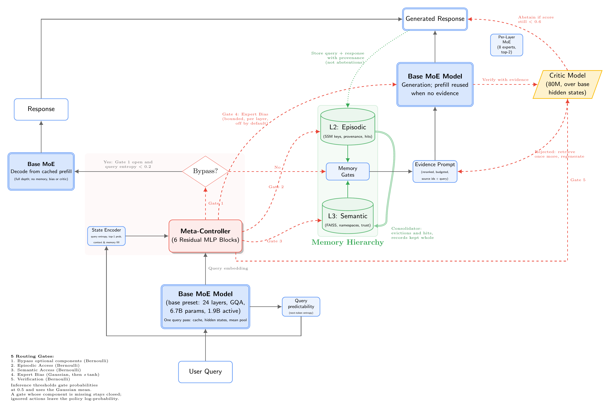

# MANTIS: Metacognitive Adaptive Network with Tiered Inference Strategies

A novel LLM architecture exploring hallucination mitigation and long-context memory through metacognitive routing, hierarchical memory systems, and integrated self-verification.

**Status**: Research prototype with complete architecture implementation but no trained models.

## Architecture



**Components**:
- **Three-tier memory**: Attention (8K) → Episodic SSM → Semantic FAISS
- **Meta-controller**: RL-trainable routing with 5 decision gates
- **MoE base model**: ~6.8B total, ~2B active parameters (8 experts, top-2)
- **Critic model**: Integrated hallucination detection

**Design Goals** (unvalidated): Reduced hallucinations via verification • Extended context via hierarchical memory • Efficiency via sparse experts • Lower latency via early-exit

---

## Quick Start

```bash
# Install everything (mamba-ssm needs CUDA)
pip install -r requirements.txt && pip install -e .

# Or install only the core: Stage 1, the tokenizer and basic inference
pip install -e .

# Start training (Stage 1)
python train.py --stage 1 \
    --hf-dataset roneneldan/TinyStories \
    --hf-val-split validation \
    --streaming \
    --steps-per-epoch 1000
```

---

## Training Pipeline

MANTIS trains in four stages. Stage 1 is required; Stages 2 and 4 each need only Stage 1, and Stage 3 uses whatever Stages 2 and 4 produced:

```
┌─────────────────────────────────────────────────────────────────┐
│  Stage 1: Base MoE Pre-training (REQUIRED)                     │
│  ├─ Trains: Transformer backbone + MoE experts                 │
│  ├─ Duration: Days-weeks                                        │
│  └─ Output: Functional LLM ready for text generation            │
└─────────────────────────────────────────────────────────────────┘
                            ↓
┌─────────────────────────────────────────────────────────────────┐
│  Stage 2: Memory Fine-tuning (OPTIONAL)                        │
│  ├─ Trains: Episodic + Semantic memory systems                 │
│  ├─ Duration: Days                                              │
│  └─ Output: Extended context beyond 8K tokens                   │
└─────────────────────────────────────────────────────────────────┘
                            ↓
┌─────────────────────────────────────────────────────────────────┐
│  Stage 4: Critic Training (OPTIONAL)                           │
│  ├─ Trains: Hallucination critic (enables verification)        │
│  └─ Output: critic_best.pt                                      │
└─────────────────────────────────────────────────────────────────┘
                            ↓
┌─────────────────────────────────────────────────────────────────┐
│  Stage 3: RL Training (OPTIONAL)                               │
│  ├─ Trains: Meta-controller routing policy                     │
│  ├─ Duration: Hours-days                                        │
│  └─ Output: Adaptive compute & improved efficiency             │
└─────────────────────────────────────────────────────────────────┘
```

**What you need**:
- Basic LLM: Stage 1 only
- + Long context: Stage 1 + 2
- + Adaptive routing: Stage 1 + 3
- Full MANTIS: all 4 stages

---

## Stage 1: Base MoE Pre-training (REQUIRED)

**What it trains**: Foundation transformer model with Mixture-of-Experts
- Standard next-token prediction
- Top-2 routing over 4 experts (`tiny`, `small`) or 8 (`base`); `micro` is dense
- Load balancing loss
- No memory systems (added in Stage 2)
- No meta-controller (added in Stage 3)

### Basic Training

```bash
# Streaming HuggingFace dataset (recommended - no storage needed)
python train.py --stage 1 \
    --hf-dataset roneneldan/TinyStories \
    --hf-val-split validation \
    --streaming \
    --steps-per-epoch 1000 \
    --epochs 10 \
    --model-size tiny

# Local text file (auto-split validation)
python train.py --stage 1 \
    data/train.txt \
    --val-split 0.1 \
    --epochs 20 \
    --model-size tiny

# Production: Pre-split validation for reproducibility
python train.py --stage 1 \
    data/train.txt \
    --val-file data/val.txt \
    --output-dir checkpoints/stage1 \
    --model-size small
```

### Data Sources

**Option 1: HuggingFace Streaming (Easiest)**
```bash
# No download needed - stream directly
python train.py --stage 1 \
    --hf-dataset HuggingFaceFW/fineweb-edu \
    --hf-config sample-10BT \
    --streaming \
    --steps-per-epoch 1000 \
    --mixed-precision

# Use only 10% of dataset
python train.py --stage 1 \
    --hf-dataset wikitext \
    --hf-config wikitext-2-raw-v1 \
    --hf-train-split "train[:10%]" \
    --hf-val-split validation

# Popular datasets:
#   roneneldan/TinyStories      - Small stories (testing)
#   wikitext                     - Wikipedia text
#   openwebtext                  - Web corpus
#   HuggingFaceFW/fineweb-edu   - High-quality web text (10BT subset)
```

**Option 2: Pre-tokenized Local Data (Fastest)**
```bash
# Step 1: Pre-tokenize once (5-10x faster for multiple runs)
python scripts/preprocess_data.py \
    --input data/train.txt \
    --output data/tokenized/train

# Step 2: Split data
python scripts/split_dataset.py  # Creates train_split/ and val/

# Step 3: Train
python train.py --stage 1 \
    data/tokenized/train_split \
    --pretokenized \
    --val-file data/tokenized/val \
    --model-size small
```

**Option 3: Raw Text Files (Simplest)**
```bash
# Single file with auto-split validation
python train.py --stage 1 data/train.txt --val-split 0.1

# Separate train/val files (recommended for production)
python train.py --stage 1 data/train.txt --val-file data/val.txt
```

### Model Sizes

| Size | Parameters (active) | Use Case | Training VRAM |
|------|-----------|----------|-------------|
| `micro` | ~3M (dense) | Ultra-fast testing | ~0.4GB |
| `tiny` | ~57M (~32M) | Development/debugging | ~1.4GB |
| `small` | ~454M (~252M) | Experimentation | ~8GB |
| `base` | ~6.8B (~2B) | Production | ~106GB (~64GB with `--gradient-checkpointing --use-8bit-optimizer`) |

VRAM comes from `mantis/training/vram_estimator.py` for FP16 mixed precision, batch size 1 and `--seq-len 512`.

```bash
# Specify size with --model-size
python train.py --stage 1 data/train.txt --model-size small --val-split 0.1
```

### Multi-GPU Training

```bash
# Auto-detect all GPUs
python train.py --stage 1 data/train.txt --mixed-precision --val-split 0.1

# Use specific GPUs only
python train.py --stage 1 data/train.txt --gpu-ids 0 2 --val-split 0.1

# Mixed VRAM (e.g., 12GB + 6GB GPUs)
python train.py --stage 1 data/train.txt \
    --batch-size 2 \
    --gradient-accumulation-steps 4 \
    --mixed-precision \
    --val-split 0.1
# Effective batch: 2 × 4 = 8 per GPU, times the number of GPUs

# DeepSpeed ZeRO-2 with optimizer offload (for very large models or mixed VRAM)
python train.py --stage 1 data/train.txt \
    --deepspeed \
    --cpu-offload \
    --model-size small \
    --batch-size 1 \
    --gradient-accumulation-steps 4 \
    --val-split 0.1
```

### Memory Optimization

```bash
# Basic: Mixed precision (2x memory savings)
python train.py --stage 1 data/train.txt --mixed-precision --val-split 0.1

# Advanced: Gradient checkpointing (40% memory, 30% slower)
python train.py --stage 1 data/train.txt \
    --mixed-precision \
    --gradient-checkpointing \
    --val-split 0.1

# Maximum: 8-bit optimizer (50% optimizer memory)
python train.py --stage 1 data/train.txt \
    --mixed-precision \
    --gradient-checkpointing \
    --use-8bit-optimizer \
    --batch-size 1 \
    --gradient-accumulation-steps 16 \
    --val-split 0.1

# Extreme: Small model on 12GB GPU
python train.py --stage 1 data/train.txt \
    --model-size small \
    --mixed-precision \
    --gradient-checkpointing \
    --use-8bit-optimizer \
    --batch-size 1 \
    --gradient-accumulation-steps 16 \
    --val-split 0.1
```

### Resume Training

```bash
# Resume from checkpoint (continues from saved state)
python train.py --stage 1 data/train.txt \
    --resume checkpoints/stage1/best_model.pt \
    --tokenizer-path checkpoints/stage1/tokenizer \
    --val-split 0.1

# Continue for more epochs (e.g., 20 → 50 total epochs)
python train.py --stage 1 data/train.txt \
    --resume checkpoints/stage1/final_model.pt \
    --tokenizer-path checkpoints/stage1/tokenizer \
    --epochs 50 \
    --val-split 0.1
```

**Note**: `--tokenizer-path` is required when resuming. Resuming restores model weights, optimizer state, scheduler, and training progress. Use the same data source as the original run: a local file if it trained on one, `--hf-dataset` if it streamed.

### Outputs (Stage 1)

- `checkpoints/stage1/best_model.pt` - Best validation checkpoint
- `checkpoints/stage1/final_model.pt` - Final epoch checkpoint
- `checkpoints/stage1/tokenizer/` - Tokenizer files (reuse for later stages)
- `checkpoints/stage1/epoch_N.pt` - Periodic checkpoints (`--save-every`)

### Full Example: Production Training

```bash
# High-quality training run with all optimizations
python train.py --stage 1 \
    --hf-dataset HuggingFaceFW/fineweb-edu \
    --hf-config sample-10BT \
    --streaming \
    --steps-per-epoch 1000 \
    --model-size small \
    --output-dir checkpoints/stage1_production \
    --epochs 10 \
    --batch-size 8 \
    --gradient-accumulation-steps 64 \
    --learning-rate 3e-4 \
    --warmup-steps 100 \
    --mixed-precision \
    --gradient-checkpointing \
    --use-8bit-optimizer \
    --eval-every 500 \
    --patience 5 \
    --save-every 1

# Duration: ~Days-weeks depending on hardware
# Output: checkpoints/stage1_production/best_model.pt
```

---

## Stage 2: Memory Fine-tuning (OPTIONAL)

**What it trains**: Hierarchical memory systems for extended context, with the Stage 1 model frozen
- Episodic memory SSM: a query's state learns to match its context's state (contrastive)
- Semantic projection: projected query embeddings learn to retrieve their context (contrastive)
- Afterwards every context goes into a semantic memory store (`semantic_memory.index/.meta`)

**When to use**: If you need context beyond the 8K attention window

**Status**: IMPLEMENTED

### Usage

```bash
# Fine-tune memory on top of Stage 1 model
python train.py --stage 2 \
    --resume checkpoints/stage1/best_model.pt \
    --tokenizer-path checkpoints/stage1/tokenizer \
    --epochs 5 \
    --output-dir checkpoints/stage2

# With your own data (recommended): JSONL lines of {"query": ..., "context": ...}
python train.py --stage 2 data/memory.jsonl \
    --resume checkpoints/stage1/best_model.pt \
    --tokenizer-path checkpoints/stage1/tokenizer \
    --epochs 5 \
    --steps-per-epoch 500 \
    --output-dir checkpoints/stage2
```

**Note**: Without a data file, Stage 2 uses an 8-pair demo set. Build real pairs from long-context datasets (QuALITY, NarrativeQA, etc.). Stage 1-only flags such as `--hf-dataset` or `--mixed-precision` are rejected.

---

## Stage 4: Critic Training (OPTIONAL)

**What it trains**: The critic that scores whether a response is correct. A trained critic enables the verification gate in Stage 3 and in the full engine.

```bash
# JSONL lines of {"query": ..., "response": ..., "facts": ... (optional), "label": 0 or 1}
python train.py --stage 4 data/critic.jsonl \
    --resume checkpoints/stage1/best_model.pt \
    --tokenizer-path checkpoints/stage1/tokenizer \
    --epochs 3 \
    --output-dir checkpoints/critic
```

---

## Stage 3: RL Training (OPTIONAL)

**What it trains**: Meta-controller routing policy via reinforcement learning
- 5 decision gates:
  - Early exit (skip processing for simple queries)
  - Episodic memory access
  - Semantic memory retrieval
  - Expert selection (MoE routing)
  - Verification trigger (critic model)
- PPO (Proximal Policy Optimization)
- Multi-objective reward: accuracy - 0.3×latency - 0.2×compute + 0.5×calibration

**When to use**: After Stage 1 to optimize dynamic routing and efficiency. Each optional component (Stage 2 memory, Stage 2 semantic store, Stage 4 critic) enables its gate; without it the gate stays closed.

**Status**: IMPLEMENTED

### Usage

```bash
# Optimize meta-controller on top of Stage 1 model
python train.py --stage 3 \
    --resume checkpoints/stage1/best_model.pt \
    --tokenizer-path checkpoints/stage1/tokenizer \
    --rl-episodes 50000 \
    --rl-batch-size 256 \
    --output-dir checkpoints/stage3

# All gates, with your own JSONL lines of {"query": ..., "answer": ...}
python train.py --stage 3 data/qa.jsonl \
    --resume checkpoints/stage1/best_model.pt \
    --tokenizer-path checkpoints/stage1/tokenizer \
    --memory-checkpoint checkpoints/stage2/memory_system_final.pt \
    --semantic-store checkpoints/stage2/semantic_memory \
    --critic-checkpoint checkpoints/critic/critic_best.pt \
    --rl-episodes 100000 \
    --output-dir checkpoints/stage3_full
```

**Note**: Without a data file, Stage 3 uses a 10-pair demo set. For production, provide 1000+ query-answer pairs. The saved `meta_controller_rl.pt` records the component paths, so `MANTISInferenceEngine.from_checkpoints(policy_checkpoint=...)` rebuilds the full engine.

**Expected Results**:
- Improved efficiency via adaptive routing
- Better accuracy/latency trade-offs
- Dynamic compute allocation based on query complexity

---

## Inference

After Stage 1 training completes, use the model for text generation:

```bash
# Interactive mode
python inference.py checkpoints/stage1/best_model.pt

# Single prompt
python inference.py checkpoints/stage1/best_model.pt \
    --prompt "Once upon a time"

# Greedy decoding (deterministic, temperature=0)
python inference.py checkpoints/stage1/best_model.pt \
    --prompt "The capital of France is" \
    --temperature 0

# Creative generation (higher temperature)
python inference.py checkpoints/stage1/best_model.pt \
    --prompt "Write a story about robots:" \
    --temperature 1.2 \
    --max-length 200

# Batch generation from file
python inference.py checkpoints/stage1/best_model.pt \
    --input prompts.txt \
    --output results.txt

# INT8 dynamic quantization (always runs on CPU)
python inference.py checkpoints/stage1/best_model.pt \
    --prompt "Hello world" \
    --quantize int8
```

The model's context window equals the `--seq-len` it was trained with. Longer generations re-encode the most recent half-window when the cache fills.

**RTX 3060 Known Issue**: If you encounter `CUBLAS_STATUS_NOT_INITIALIZED` errors:
```bash
export CUBLAS_WORKSPACE_CONFIG=:0:0
export TORCH_BLAS_PREFER_CUBLASLT=0
python inference.py checkpoints/stage1/best_model.pt --prompt "Hello"
```

---

## Evolution Simulation

The 512-token tokenizer is built for the protocol of `mantis/simulation`, an ecological simulator that writes evolving ecosystems as text. A model trained on these traces continues a world tick by tick. [EVOLUTION_SIM_OVERVIEW.md](EVOLUTION_SIM_OVERVIEW.md) covers the simulator, the protocol and the training settings.

```bash
# 1. Generate three datasets, capped at increasing epochs
python scripts/gen_evo_dataset.py --worlds 5000 --max-epoch CAMBRIAN  --output data/evo_bio.txt --compact --workers 8
python scripts/gen_evo_dataset.py --worlds 5000 --max-epoch ECOSYSTEM --output data/evo_eco.txt --compact --workers 8 --enable-agents
python scripts/gen_evo_dataset.py --worlds 5000                       --output data/evo_intel.txt --compact --workers 8 --enable-agents

# 2. Train with a curriculum that shifts from the bio to the intel data
python train_evo.py \
    --bio data/evo_bio.txt --eco data/evo_eco.txt --intel data/evo_intel.txt \
    --model-size tiny --seq-len 2048 --batch-size 8 \
    --steps-per-epoch 1000 --epochs 20 --mixed-precision --val-split 0.1

# 3. Generate a new world
python inference_evo.py checkpoints/evo_train/best_model.pt --new-world --seed 42 --max-ticks 100
```

`web/` holds a browser playground that replays datasets from `data/`, runs the simulator live, or streams a model from `checkpoints/`:

```bash
cd web/client && npm install && npm run build && cd ../..
pip install -r web/server/requirements.txt
python web/server/app.py   # open http://localhost:5000
```

---

## Common Training Options

### Key Flags

| Flag | Description | Example |
|------|-------------|---------|
| `--stage` | Training stage (1-4) | `--stage 1` |
| `--model-size` | Model size (micro/tiny/small/base) | `--model-size small` |
| `--hf-dataset` | HuggingFace dataset name | `--hf-dataset wikitext` |
| `--streaming` | Stream without download | `--streaming` |
| `--val-split` | Auto-split validation (%) | `--val-split 0.1` |
| `--val-file` | Separate validation file | `--val-file data/val.txt` |
| `--resume` | Resume from checkpoint | `--resume ckpt/best_model.pt` |
| `--tokenizer-path` | Reuse existing tokenizer | `--tokenizer-path ckpt/tokenizer` |
| `--mixed-precision` | Use FP16 (2x memory save) | `--mixed-precision` |
| `--gradient-checkpointing` | Trade compute for memory | `--gradient-checkpointing` |
| `--use-8bit-optimizer` | 8-bit AdamW (50% optimizer memory) | `--use-8bit-optimizer` |
| `--deepspeed` | Enable DeepSpeed ZeRO-2 | `--deepspeed` |
| `--gpu-ids` | Select specific GPUs | `--gpu-ids 0 2` |

Full list: `python train.py --help`

### Validation Options

```bash
# Auto-split at document boundaries (convenient; no document lands in both splits)
--val-split 0.1

# Pre-split file (reproducible, production)
--val-file data/val.txt

# HuggingFace dataset split
--hf-val-split validation

# Cannot combine --val-split with --val-file
```

### Tokenizer Management

```bash
# First run: Creates tokenizer
python train.py --stage 1 data/train.txt --val-split 0.1
# → Saves to checkpoints/train/tokenizer

# Later runs: Reuse for consistency
python train.py --stage 1 data/new.txt \
    --tokenizer-path checkpoints/train/tokenizer \
    --val-split 0.1
```

---

## Troubleshooting

### Out of Memory (OOM)

Try these in order (the full commands are under [Memory Optimization](#memory-optimization)):

1. Add `--mixed-precision`
2. Add `--gradient-checkpointing`
3. Reduce `--batch-size` (to 2 or 1)
4. Add `--gradient-accumulation-steps 8` (or higher)
5. Add `--use-8bit-optimizer`
6. Add `--deepspeed --cpu-offload` (multi-GPU only)
7. Use a smaller `--model-size`

### Slow Training

```bash
# Pre-tokenize data (5-10x faster)
python scripts/preprocess_data.py --input data/train.txt --output data/tok
python train.py --stage 1 data/tok --pretokenized --val-split 0.1

# Use streaming HF datasets (no disk I/O)
python train.py --stage 1 --hf-dataset wikitext --streaming

# Enable mixed precision (2x faster)
python train.py --stage 1 data/train.txt --mixed-precision --val-split 0.1

# Use multiple GPUs
python train.py --stage 1 data/train.txt --val-split 0.1  # Auto-detects
```

---

## Project Structure

```
mantis/
├── models/           # base_moe, meta_controller, critic, ssm
├── memory/           # episodic, semantic, consolidation
├── training/         # common, pretrain, memory_train, rl_train, critic_train
├── inference/        # generation (shared decode loop), engine
├── simulation/       # Ecological simulator that generates evolution training data
├── configs/          # model_config (presets: micro/tiny/small/base)
├── utils/            # checkpoints (schema, model and tokenizer loading)
├── data.py           # Documents, EOS, packing, leak-free splits
├── tokenizer.py      # MANTISTokenizer (trie-based, 512 tokens, byte fallback)
evaluation/           # benchmarks, metrics, evaluation harness
├── benchmarks.py     # MMLU, TruthfulQA, HumanEval, GSM8K
├── metrics.py        # Accuracy, F1, hallucination rate, calibration
train.py              # Main training script (--stage 1/2/3/4)
inference.py          # Text generation script
train_evo.py          # Evolution curriculum training
inference_evo.py      # Tick-by-tick evolution generation
scripts/              # preprocess_data, split_dataset, run_eval, gen_evo_dataset, calc_seq_len
web/                  # Simulation playground (Flask server, React client)
```

---

## Requirements & Validation

**Current Status**: Research prototype with complete architecture but **no trained weights**.

**Training Requirements** (for production results):
- Compute: 2-5T tokens • ~50K-130K A100 GPU-hours for the `base` preset (6 × 2B active parameters × tokens, at ~125 TFLOPS sustained)
- Data: High-quality corpus (FineWeb-edu, C4, etc.)
- Time: Weeks-months for full training

**Evaluation Requirements** (to validate design claims):
- Benchmarks: MMLU, TruthfulQA, HumanEval, GSM8K
- Hallucination metrics
- Baseline comparisons: Use `scripts/run_eval.py`

**Current Limitations**:
- No trained weights (architecture only)
- True attention limited to 8K (not 1M)
- Episodic memory needs a CUDA-capable GPU (mamba-ssm), so Stage 2, Stage 3 and the full engine do too

---

## Component Details

### BaseMoEModel
- Top-2 routing over 4 or 8 experts (dense for `micro`)
- Load balancing loss
- Scales from 3M to 6.8B parameters across the CLI presets
- Pre-norm transformer backbone with rotary positional embeddings

### MetaController
- 6 residual MLP blocks over the pooled query embedding and a state summary
- 5 routing gates: early-exit, episodic/semantic memory, expert selection, verification
- RL-trainable via PPO (Stage 3)

### Memory Systems
- **Episodic**: Mamba SSM (mamba-ssm library), 8K token window, L2 cache
- **Semantic**: FAISS vector DB with stable IDs, 1M+ entries, L3 cache. Evicted IDs are tombstoned, and the index rebuilds when more than 20% are stale
- **Consolidation**: Background transfer episodic → semantic using base model embeddings

### Critic Model
- ~155M-parameter verification model: a 12-layer encoder over query, response and retrieved facts
- Hallucination detection via consistency checking; the engine abstains when the score falls below 0.6

---

## Known Issues & Warnings

### Semantic Memory Scaling
Stores embeddings in RAM (12GB+ for 1M entries).
- **Limit**: ~100K entries on 16GB RAM systems
- **Solution**: Disk-backed storage planned for production

### TextDataset Memory
Loads all tokens into RAM (2 bytes per token, not true streaming). Text files hold documents separated by blank lines; each document ends with one EOS token.
- **Limit**: ~10GB text files on 32GB RAM systems
- **Solution**: Use `--pretokenized` or `--hf-dataset --streaming`

---

## Evaluation

Run benchmarks on trained models:

```bash
# Test with demo dataset
python scripts/run_eval.py checkpoints/stage1/best_model.pt \
    --tokenizer checkpoints/stage1/tokenizer \
    --all --demo

# Run specific benchmarks (downloaded from the HuggingFace Hub)
python scripts/run_eval.py checkpoints/stage1/best_model.pt \
    --tokenizer checkpoints/stage1/tokenizer \
    --benchmarks mmlu truthfulqa --limit 500 \
    --output results.json

# Full MANTIS engine rebuilt from a Stage 3 policy
python scripts/run_eval.py checkpoints/stage1/best_model.pt \
    --all \
    --policy-checkpoint checkpoints/stage3/meta_controller_rl.pt \
    --output full_results.json
```

**Available Benchmarks**:
- MMLU (knowledge across 57 subjects)
- TruthfulQA (hallucination detection)
- HumanEval (code generation)
- GSM8K (math reasoning)

**Metrics**: Accuracy, hallucination rate, calibration error, pass rate. Confidence is the geometric-mean probability of the generated tokens. TruthfulQA counts a response as truthful when it is closer (token F1) to a true reference than to any false one. HumanEval runs generated code in a resource-limited subprocess, which is not a security sandbox.

---

## License & Acknowledgments

MIT License - Nicolás Iglesias <nfiglesias@gmail.com>

---

**Disclaimer**: Research prototype. Performance claims are unvalidated architectural design goals requiring large-scale training and evaluation for proper assessment. No trained models or benchmark results are currently available.
