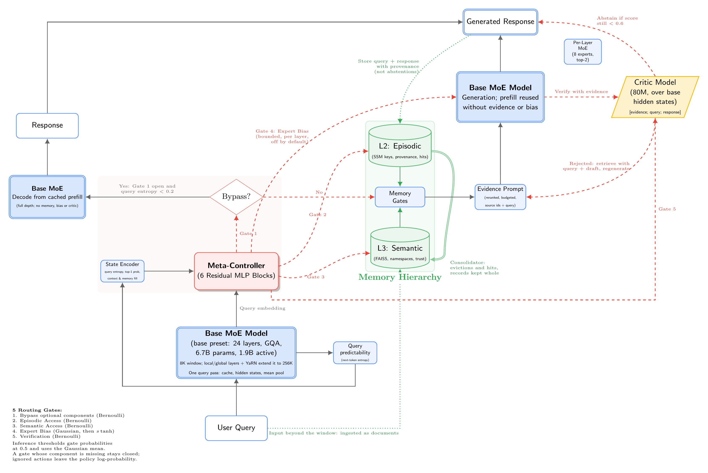
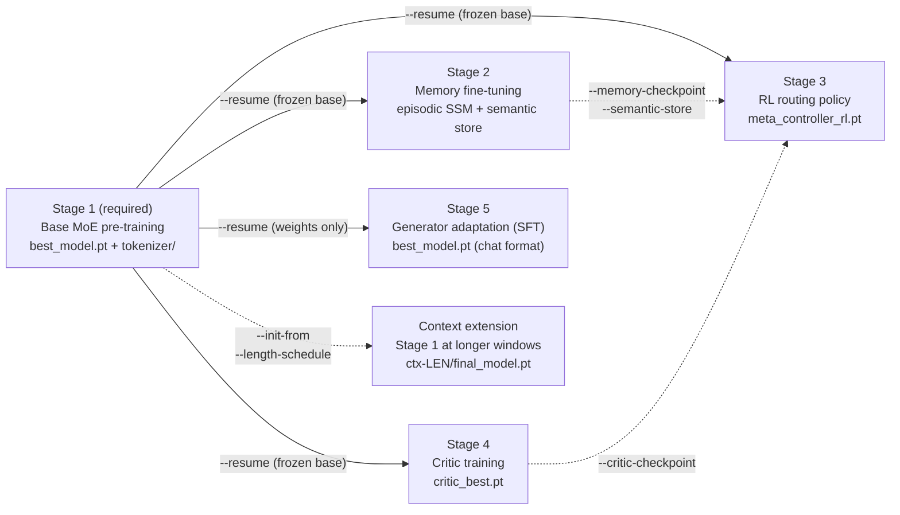

# MANTIS: Metacognitive Adaptive Network with Tiered Inference Strategies

MANTIS is a research LLM architecture that aims to reduce hallucinations and extend context with a learned router, a three-tier memory and a verifying critic. The implementation is complete, but no trained weights exist and every design claim below is unvalidated.

## Architecture



- **Base model**: a sparse Mixture-of-Experts transformer with top-2 routing over 8 experts and grouped-query attention. The `base` preset has 6.7B parameters, 1.9B of them active per token.
- **Memory**: attention over the model window (8K for `base`, 256K after context extension), an episodic buffer with Mamba SSM retrieval keys, and a FAISS semantic store with namespaces and trust levels.
- **Meta-controller**: an RL-trained policy with five gates: bypass, episodic memory, semantic memory, expert bias and verification.
- **Critic**: a verification head over the frozen base model's hidden states. When it rejects an answer, the engine retrieves evidence once more, then abstains.

The design goals are fewer hallucinations through evidence-grounded verification, longer context through memory, efficiency through sparse experts, and lower cost by skipping retrieval and verification on predictable queries. [Components](#components) has the details.

## Quick start

The project uses [uv](https://docs.astral.sh/uv/): `uv run` creates `.venv` from `uv.lock` on first use and keeps it in sync.

```bash
# Core: Stage 1, the tokenizer and inference (CUDA torch on Linux)
uv sync

# Extras: memory (mamba-ssm + faiss, needs CUDA and nvcc), distributed (DeepSpeed), bnb (8-bit optimizer),
# wandb, web (playground). mamba-ssm compiles from source when no wheel matches; TORCH_CUDA_ARCH_LIST limits it to your GPUs
TORCH_CUDA_ARCH_LIST="8.6" MAX_JOBS=4 uv sync --extra memory --extra distributed

# Train a small model on TinyStories, then sample from it
uv run train.py --stage 1 --hf-dataset roneneldan/TinyStories --hf-val-split validation \
    --streaming --steps-per-epoch 1000 --model-size tiny --output-dir checkpoints/stage1
uv run inference.py checkpoints/stage1/best_model.pt --prompt "Once upon a time"
```

## Training pipeline

MANTIS trains in five stages, but they do not form a chain:


```mermaid
flowchart LR
    S1["Stage 1 (required)<br/>Base MoE pre-training<br/>best_model.pt + tokenizer/"]
    S2["Stage 2<br/>Memory fine-tuning<br/>episodic SSM + semantic store"]
    S4["Stage 4<br/>Critic training<br/>critic_best.pt"]
    S3["Stage 3<br/>RL routing policy<br/>meta_controller_rl.pt"]
    S5["Stage 5<br/>Generator adaptation (SFT)<br/>best_model.pt (chat format)"]
    CE["Context extension<br/>Stage 1 at longer windows<br/>ctx-LEN/final_model.pt"]
    S1 -- "--resume (frozen base)" --> S2
    S1 -- "--resume (frozen base)" --> S4
    S1 -- "--resume (frozen base)" --> S3
    S1 -- "--resume (weights only)" --> S5
    S1 -. "--init-from<br/>--length-schedule" .-> CE
    S2 -. "--memory-checkpoint<br/>--semantic-store" .-> S3
    S4 -. "--critic-checkpoint" .-> S3
```

Only Stages 1 and 5 train the base model. Stages 2–4 each train one component against the frozen Stage 1 checkpoint they receive with `--resume`. Stage 3 takes the dotted inputs if you have them and keeps the matching gates closed if you don't. The engine rejects memory, critic and policy artifacts trained against a different backbone. To serve a Stage 5 or context-extended model, train it first, pass it to `--resume` in Stages 2–4, and run Stage 3 last.

| You want | Train stages |
|----------|--------------|
| A plain language model | 1 |
| Memory beyond the attention window | 1 + 2 |
| Adaptive routing | 1 + 3 |
| A generator that follows instructions and cites evidence | 1 + 5 |
| Full MANTIS | all five |

Stages 2–4 take an optional JSONL file and fall back to a small demo set without it. They reject Stage 1-only flags such as `--hf-dataset` and `--mixed-precision`.

## Stage 1: base model (required)

Stage 1 pre-trains the MoE model on next-token prediction with a load-balancing loss.

### Data

```bash
# Hugging Face, streamed without a download
uv run train.py --stage 1 --hf-dataset HuggingFaceFW/fineweb-edu --hf-config sample-10BT \
    --streaming --steps-per-epoch 1000 --mixed-precision

# A slice of a Hugging Face dataset
uv run train.py --stage 1 --hf-dataset wikitext --hf-config wikitext-2-raw-v1 \
    --hf-train-split "train[:10%]" --hf-val-split validation

# Local text: validation split off the last documents, or a separate file (reproducible)
uv run train.py --stage 1 data/train.txt --val-split 0.1
uv run train.py --stage 1 data/train.txt --val-file data/val.txt

# Pre-tokenized: 5-10x faster when you train more than once
uv run scripts/preprocess_data.py --input data/train.txt --output data/tokenized/train
uv run scripts/split_dataset.py   # writes data/tokenized/train_split and data/tokenized/val
uv run train.py --stage 1 data/tokenized/train_split --pretokenized --val-file data/tokenized/val
```

Text files hold documents separated by blank lines, and each document gets one EOS token. `--val-split` never puts a document in both splits and cannot be combined with `--val-file`. Hugging Face data uses `--hf-val-split` instead. Raw text loads fully into RAM at 2 bytes per token, so files above about 10 GB need `--pretokenized` or `--streaming`.

### Tokenizer

Without `--tokenizer-path`, Stage 1 trains a byte-level BPE tokenizer (32,768 tokens, `--vocab-size`) on the first 100,000 documents (`--tokenizer-train-docs`) and saves it to `<output-dir>/tokenizer`. Later stages, resumed runs and inference load that copy. Checkpoints and pre-tokenized datasets record its fingerprint and refuse any other tokenizer. `scripts/preprocess_data.py` saves its tokenizer next to `--output`, where `--pretokenized` finds it.

```bash
# Reuse a tokenizer on new data
uv run train.py --stage 1 data/new.txt --tokenizer-path checkpoints/stage1/tokenizer --val-split 0.1

# Evolution traces: the fixed 512-token tokenizer of the simulation protocol
uv run train.py --stage 1 data/evo.txt --tokenizer mantis --val-split 0.1
```

### Model sizes

| Size | Parameters (active) | Query/KV heads | Controller | Critic | Use | Training VRAM |
|------|-----------|------|------|------|----------|-------------|
| `micro` | ~3M (dense) | 4/4 | 0.6M | 2.2M | Quick tests | ~0.7GB |
| `tiny` | ~55M (~30M) | 8/4 | 2.4M | 14M | Development | ~1.9GB |
| `small` | ~435M (~234M) | 32/8 | 18M | 45M | Experiments | ~10GB (~7GB with `--gradient-checkpointing --use-8bit-optimizer`) |
| `medium` | ~2.1B (~0.6B) | 24/8 | 41M | 80M | One 48 GB GPU | ~42GB (~29GB with `--gradient-checkpointing --use-8bit-optimizer`) |
| `base` | ~6.7B (~1.9B) | 32/8 | 106M | 80M | Production | ~128GB (~89GB with `--gradient-checkpointing --use-8bit-optimizer`) |

Pick one with `--model-size`. Parameter counts assume the 512-token evolution tokenizer. The default 32K BPE vocabulary adds `32768 × d_model` tied embedding parameters: 8M for `micro`, 134M for `base`. The controller and critic scale with the preset. VRAM figures come from `mantis/training/vram_estimator.py` for FP16 mixed precision, batch size 1, `--seq-len 512` and the 32K vocabulary.

### Multiple GPUs

```bash
# One process per GPU (a plain `uv run train.py` uses one GPU); --gpu-ids picks the cards
uv run torchrun --nproc_per_node=2 train.py --stage 1 data/train.txt --mixed-precision --val-split 0.1
uv run torchrun --nproc_per_node=2 train.py --stage 1 data/train.txt --gpu-ids 0 2 --val-split 0.1

# DeepSpeed ZeRO-2 with optimizer offload (needs --extra distributed)
uv run torchrun --nproc_per_node=2 train.py --stage 1 data/train.txt --deepspeed --cpu-offload \
    --model-size small --batch-size 1 --gradient-accumulation-steps 4 --val-split 0.1

# A model too large for one GPU: one process, layers split over all visible GPUs by free VRAM
uv run train.py --stage 1 data/train.txt --pipeline --model-size small \
    --mixed-precision --gradient-checkpointing --batch-size 32 --val-split 0.1
```

Under torchrun every rank uses the same batch size: the largest that fits the smallest GPU's free VRAM, capped by `--batch-size`. `--pipeline` and `--auto-batch` size the batch from free VRAM the same way. Pipelined GPUs run one after another, so `--pipeline` adds memory, not speed.

### Out of memory

Add these one at a time until the run fits:

1. `--mixed-precision` (FP16; `--mixed-precision bf16` on Ampere or newer)
2. `--gradient-checkpointing` (recomputes activations: less memory, slower steps)
3. A smaller `--batch-size` with more `--gradient-accumulation-steps`
4. `--use-8bit-optimizer` (halves optimizer memory; needs `--extra bnb`)
5. `--deepspeed --cpu-offload` (multi-GPU only)
6. A smaller `--model-size`

```bash
# `small` on a 12 GB GPU
uv run train.py --stage 1 data/train.txt --model-size small --mixed-precision --gradient-checkpointing \
    --use-8bit-optimizer --batch-size 1 --gradient-accumulation-steps 16 --val-split 0.1
```

### Resume and outputs

```bash
# Restores weights, optimizer, scheduler and position; a mid-epoch checkpoint resumes at the exact batch
uv run train.py --stage 1 data/train.txt --resume checkpoints/stage1/best_model.pt \
    --tokenizer-path checkpoints/stage1/tokenizer --val-split 0.1

# Train past the original schedule (e.g., 20 → 50 epochs)
uv run train.py --stage 1 data/train.txt --resume checkpoints/stage1/final_model.pt \
    --tokenizer-path checkpoints/stage1/tokenizer --epochs 50 --val-split 0.1
```

Resuming requires `--tokenizer-path` and the data source of the original run. A run writes `best_model.pt` (best validation loss), `final_model.pt`, `tokenizer/` and, with `--save-every`, `epoch_N.pt` to `--output-dir` (default `checkpoints/train`).

## Stage 2: memory (optional)

Stage 2 trains the episodic SSM and a semantic projection with contrastive losses, so that a query retrieves its own context. The Stage 1 model stays frozen. Afterwards every context goes into a semantic store (`semantic_memory.index/.meta`) in the shared `global` namespace with full trust. The store records a fingerprint of the tokenizer and backbone weights, and the engine refuses a store built by another model.

```bash
# JSONL lines of {"query": ..., "context": ...}; build real pairs from QuALITY, NarrativeQA or similar
uv run train.py --stage 2 data/memory.jsonl --resume checkpoints/stage1/best_model.pt \
    --tokenizer-path checkpoints/stage1/tokenizer --epochs 5 --steps-per-epoch 500 --output-dir checkpoints/stage2
```

Without a data file, Stage 2 trains on 8 demo pairs.

## Stage 4: critic (optional)

Stage 4 trains the critic, an encoder over the frozen Stage 1 model's hidden states of `[evidence; query; response]`, to score whether a response is correct. The data splits into train, calibration and validation parts. A temperature fitted on the calibration part turns the score into a calibrated probability, and the run reports validation accuracy, Brier score and ECE. A trained critic enables the verification gate.

```bash
# JSONL lines of {"query": ..., "response": ..., "evidence": "..." or [...] (optional), "label": 0 or 1}
uv run train.py --stage 4 data/critic.jsonl --resume checkpoints/stage1/best_model.pt \
    --tokenizer-path checkpoints/stage1/tokenizer --epochs 3 --output-dir checkpoints/critic
```

The demo set's negatives are mismatched, negated and altered answers. Real training needs near-miss negatives and outputs from the actual generator.

## Stage 3: routing policy (optional)

Stage 3 trains the meta-controller with PPO. Only the actions that affected the outcome enter the log-probability. The reward is `accuracy − 0.3 × latency − 0.2 × compute + 0.5 × calibration`:

- Accuracy is a lexical match that rejects negated answers and scores abstentions separately.
- Latency counts against a 2 s budget.
- Compute is the measured token-parameter work beyond a query-only answer.
- Calibration uses the final reported confidence.

`--rl-supervised-episodes` adds a warm start that tries every gate combination per query on frozen memory and trains toward the best one. Training episodes write to memory, so they run sequentially. Validation runs on frozen memory and reports accuracy, coverage, error rate among answered questions, p95 latency and mean compute.

```bash
# JSONL lines of {"query": ..., "answer": ...}; each optional component opens its gate
uv run train.py --stage 3 data/qa.jsonl --resume checkpoints/stage1/best_model.pt \
    --tokenizer-path checkpoints/stage1/tokenizer \
    --memory-checkpoint checkpoints/stage2/memory_system_final.pt \
    --semantic-store checkpoints/stage2/semantic_memory \
    --critic-checkpoint checkpoints/critic/critic_best.pt \
    --rl-supervised-episodes 2000 --rl-episodes 100000 --output-dir checkpoints/stage3
```

Without a data file, Stage 3 trains on 10 demo pairs; real training needs 1,000 or more. `meta_controller_rl.pt` records the component paths, so `MANTISInferenceEngine.from_checkpoints(policy_checkpoint=...)` rebuilds the whole engine. No results exist yet. The hypotheses are lower measured cost than the same backbone with every gate open at comparable quality, and a better quality–cost curve than fixed policies. `scripts/run_eval.py --route-policy` runs those controls.

## Stage 5: generator adaptation (optional)

Stages 2–4 leave the generator frozen, so better retrieval alone need not produce better answers. Stage 5 fine-tunes the base model on instruction data in the engine's runtime prompt format: `User: ... / Assistant:` turns and an `<evidence>` block whose lines carry source identifiers. The loss covers response tokens only. Records may include distractor or contradictory evidence, and unanswerable questions whose response is an abstention.

```bash
# JSONL lines of {"query": ..., "response": ..., "evidence": [...] (optional)}
uv run train.py --stage 5 data/sft.jsonl --resume checkpoints/stage1/best_model.pt \
    --tokenizer-path checkpoints/stage1/tokenizer --val-split 0.1 --epochs 3 \
    --mixed-precision bf16 --output-dir checkpoints/stage5
```

`--resume` supplies the weights only; the optimizer and schedule start fresh. Stage 1 flags apply. The checkpoint records `prompt_format = 'chat'`, so the engine builds prompts the way the model was trained.

## Long context (256K)

Context extension continues a pretrained checkpoint at longer lengths. Every layer attends to the last `--local-window` tokens except the `--global-layers`, which see the whole window with YaRN-scaled RoPE (factor = length / trained length). When the window equals the trained length, this layout computes the same function as the plain model, so any Stage 1 checkpoint carries over, including older ones.

```bash
# One command: 2K checkpoint -> 32K -> 128K -> 256K on one 48 GB GPU. Each phase starts from the previous
# phase's final model in <output-dir>/ctx-<length>; rerunning the same command resumes where it stopped
uv run train.py --stage 1 --hf-dataset emozilla/pg19 --hf-val-split validation --streaming \
    --init-from checkpoints/medium/epoch_40.pt \
    --length-schedule 32768:130M,131072:200M,262144:650M \
    --batch-size 8 --gradient-accumulation-steps 8 --steps-per-epoch 1000 --val-max-batches 25 \
    --use-8bit-optimizer --output-dir checkpoints/medium-long

# Needle-in-a-haystack by length and depth; --rope-factor tries a longer window at inference only (1M = 512)
uv run scripts/eval_long_context.py checkpoints/medium-long/ctx-262144/final_model.pt --lengths 32768 262144 --samples 5
```

`--length-schedule` takes `LENGTH:TOKENS` phases. Pass the base run's `--batch-size`, `--gradient-accumulation-steps`, `--steps-per-epoch` and `--val-max-batches`. Each phase then trains at batch 1 with the same tokens per optimizer update, per epoch and per validation, using `--extension-lr` (1e-5, 5% warmup) and `--profile long-context`. Every phase is an ordinary single-GPU `train.py` run, printed before it starts.

To run one phase by hand, use `--init-from CKPT --seq-len 262144 --profile long-context`. The profile enables:

- gradient checkpointing, with checkpoint boundaries in host RAM
- a bf16 residual stream and bf16 autocast
- chunked experts (`--moe-chunk 4096`) and chunked loss (`--loss-chunk 1024`)
- on a new schedule, the layout: window = trained length, every fifth and the last layer global, YaRN factor = `--seq-len` / trained length

Explicit layout flags override the profile, and `--resume` keeps the checkpoint's layout.

JSONL data (one `{"text": ...}` per line) keeps a book or a repository as one document. Text files split at blank lines, and each Hugging Face example is one document. Generation encodes prompts `prefill_chunk` tokens at a time and computes logits for the last position only. A 256K prompt therefore costs the global layers' KV cache and the hidden states, but no logits matrix.

The design targets one 48 GB GPU. Local layers need linear memory, and the four global layers keep full causal attention: about 3.4 PFLOP per 256K sequence for `medium`. On an RTX 3060 with `medium`-width layers, the working set grew about 1.5 GB per 32K tokens (2.1 GB at 32K, 4.8 GB at 96K). `medium` at 256K therefore needs about 34 GB, including 20.5 GB of weights, gradients and 8-bit optimizer state. Quality at 256K is not measured yet; run the needle evaluation after each phase.

## Inference

```bash
# Interactive: type prompts; `set max_length 100` changes a setting, `help`, `stats`, `quit`
uv run inference.py checkpoints/stage1/best_model.pt
uv run inference.py checkpoints/stage1/best_model.pt --prompt "Once upon a time"
uv run inference.py checkpoints/stage1/best_model.pt --prompt "The capital of France is" --temperature 0   # greedy
uv run inference.py checkpoints/stage1/best_model.pt --prompt "Write a story about robots:" \
    --temperature 1.2 --max-length 200
uv run inference.py checkpoints/stage1/best_model.pt --input prompts.txt --output results.txt   # one prompt per line
uv run inference.py checkpoints/stage1/best_model.pt --prompt "Hello" --quantize int8          # INT8, always on the CPU

# BF16, layers split over every visible GPU by free VRAM (more memory, not more speed)
uv run inference.py checkpoints/stage1/best_model.pt --prompt "Hello" --quantize bfloat16 --pipeline
```

Sampling defaults to `--temperature 0.8`, `--top-k 50` and `--top-p 0.9`, and `--max-length` caps new tokens at 50. `--device cpu` forces the CPU. The context window equals the training `--seq-len`. When the cache fills, generation re-encodes the latest half-window.

Serve a model trained with `--mixed-precision bf16` in `bfloat16`, because `float16` can overflow. A `medium` model in `bfloat16` with a 2K window needs about 5 GB of VRAM. Split over an RTX 3060 and an RTX 2060, it generated about 23 tokens/s.

The full engine (routing, memory, critic) is a Python API:

```python
from mantis.inference.engine import MANTISInferenceEngine

engine = MANTISInferenceEngine.from_checkpoints(
    policy_checkpoint="checkpoints/stage3/meta_controller_rl.pt",  # records the component paths
    memory_dir="runtime/memory",   # runtime memory state, loaded if present and checkpointed
    dtype="bfloat16",              # serving precision of the backbone
)
engine.ingest(open("notes.txt").read(), namespace="alice", source="user")
result = engine.generate("What did I decide about the venue?", namespace="alice")
print(result["response"], result["confidence"], result["confidence_source"], result["evidence"])
engine.close()  # flushes consolidation and saves memory_dir
```

`generate()` encodes the query once and decodes from that prefill unless it prepends evidence. It ingests input longer than the window into memory as document chunks. The result reports the path taken, the critic score, whether the engine abstained, the evidence identifiers, per-component timings, token counts and `compute_units`. `frozen_memory()` disables memory writes for evaluation. `generate(evidence=[...])` supplies oracle evidence instead of retrieval, and `force_gates=` or `InferenceConfig.route_policy` (`learned`, `always`, `never`, `bypass`) replace the policy for ablations.

Two GPU problems have opt-in fixes; the code sets neither automatically. For `CUBLAS_STATUS_NOT_INITIALIZED` on some Ampere consumer cards, set `CUBLAS_WORKSPACE_CONFIG=:0:0 TORCH_BLAS_PREFER_CUBLASLT=0`. If NCCL hangs on a multi-GPU box whose cards cannot do peer-to-peer transfers, set `NCCL_P2P_DISABLE=1`.

## Evolution simulation

`mantis/simulation` is an ecological simulator that writes evolving ecosystems as text, and `MANTISTokenizer` (`--tokenizer mantis`) is a fixed 512-token tokenizer for its protocol. A model trained on these traces continues a world tick by tick. [EVOLUTION_SIM_OVERVIEW.md](EVOLUTION_SIM_OVERVIEW.md) covers the simulator, the protocol and the training settings.

```bash
# 1. Generate three datasets, capped at increasing epochs
uv run scripts/gen_evo_dataset.py --worlds 5000 --max-epoch CAMBRIAN  --output data/evo_bio.txt --compact --workers 8
uv run scripts/gen_evo_dataset.py --worlds 5000 --max-epoch ECOSYSTEM --output data/evo_eco.txt --compact --workers 8 --enable-agents
uv run scripts/gen_evo_dataset.py --worlds 5000                       --output data/evo_intel.txt --compact --workers 8 --enable-agents

# 2. Train with a curriculum that shifts from the bio to the intel data
uv run train_evo.py \
    --bio data/evo_bio.txt --eco data/evo_eco.txt --intel data/evo_intel.txt \
    --model-size tiny --seq-len 2048 --batch-size 8 \
    --steps-per-epoch 1000 --epochs 20 --mixed-precision --val-split 0.1
# Partitions are tokenized once into data/.evo_cache (--cache-dir); --prepare-data-only builds the cache and exits

# 3. Generate a new world
uv run inference_evo.py checkpoints/evo_train/best_model.pt --new-world --seed 42 --max-ticks 100
```

`inference_evo.py` can also route each tick through the full engine: retrieval, the meta-controller and critic verification. This mode needs a raw-format evolution generator plus a Stage 3 policy, Stage 2 memory and store, and a Stage 4 critic, all trained against that same backbone. Train Stage 2 on evolution context/retrieval pairs, Stage 4 on valid and invalid next ticks, and Stage 3 on prefix/next-tick pairs. The policy checkpoint records the component paths; the flags override paths that moved.

```bash
uv run inference_evo.py checkpoints/evo_train/best_model.pt \
    --new-world --seed 42 --max-ticks 100 \
    --policy-checkpoint checkpoints/evo_policy/meta_controller_rl.pt \
    --memory-checkpoint checkpoints/evo_memory/memory_system_final.pt \
    --semantic-store checkpoints/evo_memory/semantic_memory \
    --critic-checkpoint checkpoints/evo_critic/critic_best.pt \
    --memory-dir runtime/evo --namespace world-42
```

The policy chooses the gates per tick; `--route-policy always` opens every available gate for an ablation, and the CLI prints gate counts to stderr. Retrieved history is prepended as trace text, and generation stops at the `---` tick delimiter. A critic rejection ends the run without writing a refusal into the trace. A long partial trace is ingested before generation. The Python API takes the same checkpoint arguments. `engine.last_result` holds each tick's route, evidence, confidence and cost, and `engine.close()` saves runtime memory. Each run gets a fresh memory namespace; to continue a world, reuse `namespace` with `memory_dir`. No trained artifacts for this mode ship with the repository, so its benefits are unmeasured.

`web/` holds a browser playground that replays datasets from `data/`, runs the simulator live, or streams a model from `checkpoints/`:

```bash
cd web/client && npm install && npm run build && cd ../..
uv sync --extra web
uv run web/server/app.py   # open http://localhost:5000
```

## Evaluation

```bash
# Demo datasets
uv run scripts/run_eval.py checkpoints/stage1/best_model.pt --all --demo

# Benchmarks downloaded from the Hugging Face Hub
uv run scripts/run_eval.py checkpoints/stage1/best_model.pt \
    --benchmarks mmlu truthfulqa --limit 500 --output results.json

# The full engine, rebuilt from a Stage 3 policy
uv run scripts/run_eval.py checkpoints/stage1/best_model.pt --all \
    --policy-checkpoint checkpoints/stage3/meta_controller_rl.pt --output full_results.json

# Ablations: fixed route policies, expert bias, serving precision, stateful memory
uv run scripts/run_eval.py checkpoints/stage1/best_model.pt --benchmarks memory \
    --policy-checkpoint checkpoints/stage3/meta_controller_rl.pt \
    --route-policy always --dtype bfloat16 --records records.jsonl

# The memory benchmark as a recent-text-buffer baseline on the bare model
uv run scripts/run_eval.py checkpoints/stage1/best_model.pt --benchmarks memory --memory-bench-mode prompt
```

| Benchmark | What it measures |
|-----------|------------------|
| MMLU | Knowledge across 57 subjects: question and lettered choices, first standalone letter within 10 new tokens |
| TruthfulQA | A lexical proxy: closer by word F1 to a true reference than to any false one; not the official judge |
| HumanEval | Code generation, run in a network-less Docker container when available, else in a resource-limited subprocess that is not a security boundary |
| GSM8K | Math reasoning |
| memory | Synthetic multi-session recall with later updates, distractors and unanswerable questions. `memory` mode uses a temporary engine namespace and freezes writes while scoring; `prompt` mode prepends every fact seen so far |

Metrics: accuracy over all questions; error rate; coverage and error rate among answered questions (abstentions count); confident-error rate (wrong with confidence ≥ 0.8); ECE; Brier score; area under the risk–coverage curve; pass rate. The engine's confidence is the critic score for a verified answer, the geometric-mean token probability otherwise, and 0 after an abstention. Benchmarks run on frozen memory unless you pass `--memory-mode stateful`. Reports include p50/p95 latency, mean `compute_units`, peak GPU memory and artifact versions. `--records` writes per-example routes, evidence identifiers and timings.

## Components

### Base model
- Top-2 routing over 4 or 8 experts (`micro` is dense), a load-balancing loss on top-1 assignments, and per-layer top-2 dispatch statistics in the output's `expert_load`
- Pre-norm transformer with rotary embeddings and grouped-query attention: the `base` preset's 8K KV cache takes 0.375 GiB in 16-bit precision instead of 1.5 GiB
- The controller's expert bias is one bounded vector per layer, added to the gate logits
- Serving precision: `load_base_model(..., dtype=)`, `from_checkpoints(dtype=)`, `run_eval.py --dtype`, `inference.py --quantize`

### Meta-controller
- Residual MLP blocks (6 at `base`, 2–4 in smaller presets) over the pooled query embedding and a state summary of query predictability, context fill and memory fill
- The bypass gate skips memory reads, expert bias and verification; the backbone always runs at full depth
- The expert bias is `scale * tanh` from a zero-initialized head and stays off until `InferenceConfig.expert_bias` is set
- A fixed route policy replaces the controller for ablations

### Memory
- **Episodic**: a Mamba SSM encodes each interaction into a 256-d retrieval key. Entries keep token segments, a pooled embedding, hit counts and provenance (namespace, source, trust, timestamp), not full hidden states. The buffer holds 100 entries by default (`max_entries`), and the oldest overflows to consolidation
- **Semantic**: a FAISS store with stable IDs, per-caller namespaces plus a shared `global` one, trust levels by source, supersession links, deletion and an embedding fingerprint. Unverified generated claims are never cited as facts. Evicted IDs are tombstoned, and the index rebuilds off-thread when more than 20% are stale. Search is exact below 10K entries and approximate (IVF-PQ) above; `recall_at_k()` measures the loss
- **Consolidation**: the engine starts it when both memories exist. Each evicted episodic entry becomes its own semantic record before it is dropped, and a periodic cycle promotes entries retrieved at least once. `engine.close()` flushes the queue and saves both stores
- **Retrieval**: tier similarity plus word F1 reranks candidates, each tier gets an equal token-budget share with leftovers passed on, the prompt carries source identifiers, and the critic sees the same evidence

### Critic
- A 6-layer encoder (~80M parameters at `base`) over the frozen base model's hidden states of `[evidence; query; response]`. The token budget goes 50% to the response, 35% to evidence and 15% to the query, with leftovers redistributed
- One correctness head, temperature-scaled in Stage 4; the engine reports its score as the answer's confidence
- Below a score of 0.6 the engine retrieves once more with the query and the draft, regenerates and rescores. If the answer still fails, it abstains and writes nothing to memory

## Project structure

```
mantis/
├── models/           # base_moe, meta_controller, critic, ssm
├── memory/           # episodic, semantic, consolidation (lifecycle), provenance (source → trust)
├── training/         # common, pretrain, memory_train, rl_train, critic_train, sft, scoring, vram_estimator, length_schedule
├── inference/        # generation (shared decode loop), prompting (evidence budget), engine
├── simulation/       # Ecological simulator that generates evolution training data
├── configs/          # model_config (presets: micro/tiny/small/medium/base)
├── utils/            # checkpoints (schema, model and tokenizer loading, fingerprints)
├── data.py           # Documents, EOS, packing, leak-free splits
├── tokenizer.py      # BPETokenizer (byte-level BPE trained on the data), MANTISTokenizer (evolution trie, 512 tokens)
evaluation/
├── benchmarks.py     # MMLU, TruthfulQA, HumanEval, GSM8K
├── memory_bench.py   # Synthetic multi-session memory benchmark
├── metrics.py        # Accuracy, error/coverage, confident errors, calibration
tests/                # Deterministic diagnostics (cache reuse, budgets, memory lifecycle, scoring)
train.py              # Main training script (--stage 1/2/3/4/5)
inference.py          # Text generation script
train_evo.py          # Evolution curriculum training
inference_evo.py      # Tick-by-tick evolution generation
scripts/              # preprocess_data, split_dataset, run_eval, eval_long_context, gen_evo_dataset, calc_seq_len, generate_paper_diagram
web/                  # Simulation playground (Flask server, React client)
```

## Status and limitations

No trained weights exist, and no benchmark, throughput or calibration result exists either. Every performance claim above is an unvalidated design goal.

Training the `base` preset on 2–5T tokens of a corpus such as FineWeb-edu would take roughly 50K–125K A100 GPU-hours (6 × 1.9B active parameters × tokens at 125 TFLOPS sustained). That estimate excludes attention, auxiliary training, evaluation, failed runs and the throughput this MoE implementation actually reaches.

Validating the design takes these steps, in order:

1. An ablation ladder on one backbone: no memory or controller → ordinary retrieval → recent-text buffer → episodic SSM → fixed policy + critic → learned router → expert bias (`run_eval.py --route-policy`, `--expert-bias`, `--memory-bench-mode prompt` vs `memory`)
2. Memory: beat ordinary retrieval on the memory benchmark with the same generator, context and storage budget
3. Efficiency: lower measured cost (`compute_units`, p95 latency) at comparable quality
4. Reliability: a lower error rate among answered questions at matched coverage on held-out sources
5. Then the benchmarks and a scale-up

Known limitations:

- True attention covers only the model window: 2K–8K in the presets, 256K after context extension (not yet evaluated). Memory extends what the generator sees only as far as retrieval recall and the evidence budget allow.
- Episodic memory needs a CUDA GPU (mamba-ssm). Stage 2 always needs one; Stage 3 and the full engine need one only when they load a Stage 2 memory checkpoint.
- Semantic memory keeps full FP32 vectors in RAM next to the index: 8.2 GB for 1M entries at `d_model` 2048, before text, metadata and rebuild copies. That limits a 16 GB machine to about 100K entries until disk-backed storage exists.
- The Stage 3 reward and TruthfulQA score answers lexically: a normalized phrase match without negation, or word F1. They reject "Paris is not the capital" for the reference "Paris" but misjudge paraphrases and penalize verbose correct answers, so report them as proxies.
- The BPE tokenizer is trained per run from a document sample, so runs on different data are not token-compatible.
- Memory retention follows retrieval hits and overflow, not what later queries need. There are no atomic facts and no conflict resolution.

## License

MIT License - Nicolás Iglesias <nfiglesias@gmail.com>
